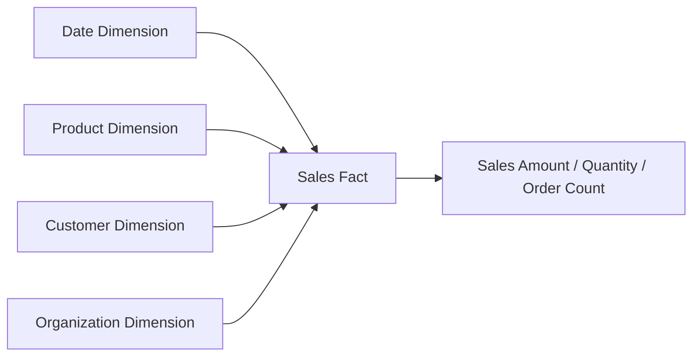
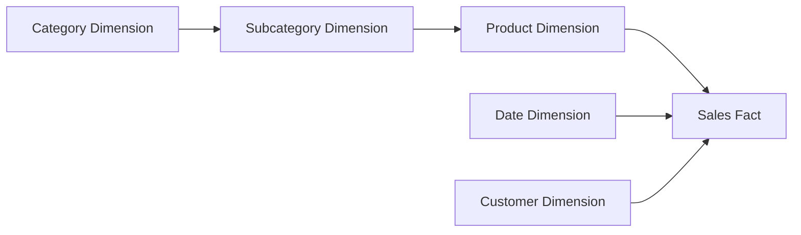
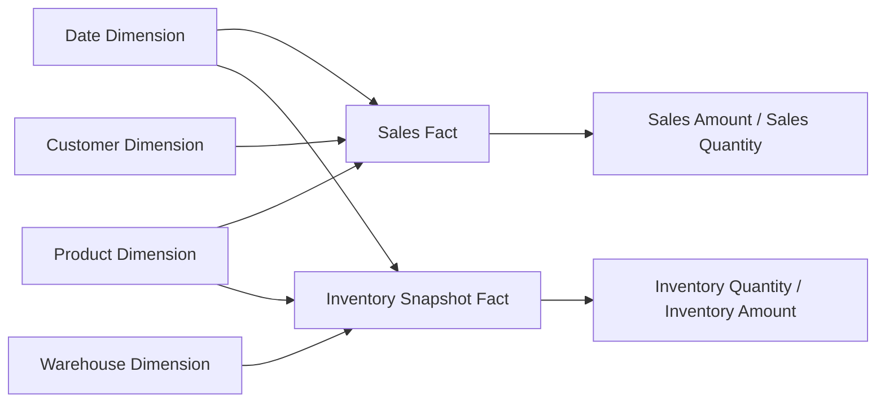

# BI Product Modeling Best Practices

## 1. Purpose

This article provides guidance for designing data models in BI product direct-query scenarios. The goal is to turn general BI modeling experience into practical rules that help model designers create stable, clear, reusable, and performance-aware semantic models.

A good direct-query model in a BI product should meet the following requirements:

- Dashboard authors can directly understand the tables, fields, relationships, and metrics in the model.
- Measures aggregate correctly under different dimensions and do not produce duplicated results because of relationship configuration.
- Relationship direction is clear, filter propagation paths are explainable, and there are no cycles or ambiguous paths.
- The model remains reasonably sized so direct queries do not push excessive computation to runtime.
- Permissions, security filters, and “show all dimension members” behavior align with the business semantics.

## 2. Define the Model Boundary First

Before modeling, clarify the business scope served by the model. Do not start by placing every database table into a single model.

It is helpful to answer these questions first:

- Which business subject does the model serve, such as sales, inventory, finance, production, customers, or device monitoring?
- Which metrics will the dashboards mainly show?
- Do the metrics come from business events, transaction records, summaries, or state snapshots?
- Which dimensions will users use to filter, group, drill, and compare?
- Is analysis across multiple fact subjects required?
- Are department, region, customer, tenant, or other permission filters required?
- Does the data need to be real-time or near real-time?
- Are the query volume, data volume, and interaction frequency suitable for direct query?

The clearer the model boundary is, the more stable the fact tables, dimension tables, relationships, and metric definitions will be. If a single model covers too many business subjects, relationships quickly become complex and dashboard authors are more likely to misuse fields.

## 3. Core Modeling Principles

Direct-query models in BI products should follow these principles first:

- Define the business grain before configuring relationships.
- Fact tables store business events and measures; dimension tables store filters, grouping attributes, display attributes, and hierarchies.
- Prefer star schemas. Snowflake schemas, fact constellations, and wide tables should be used only when they fit the scenario.
- Let filters flow from dimensions to facts by default, and use bidirectional filtering cautiously.
- Analyze multiple facts through shared dimensions or summary tables instead of directly joining fact tables to each other.
- Maintain metric definitions centrally so the same metric name does not use different formulas across dashboards.
- Push complex cleaning, heavy calculations, and frequent aggregations into database views, staging tables, summary tables, or materialized views when possible.

## 4. Table Role Design

Tables in a BI model should not be understood only as database tables. They should also be treated as business semantic objects. Every table should have a clear role.

### 4.1 Fact Tables

Fact tables store business events, transactions, state records, snapshots, or aggregatable measure data. Common examples include sales order lines, payment transactions, inventory snapshots, production records, device telemetry, exchange-rate records, and temperature records.

Fact tables usually have these characteristics:

- They contain many rows and continue growing over time.
- They include one or more foreign keys used to join dimension tables.
- They include aggregatable numeric fields, such as amount, quantity, duration, cost, and count.
- Each row represents a clear business grain.

The first task in fact table design is defining the grain. Grain means what one row in the fact table represents. For example:

- One row represents one sales order line.
- One row represents one device collection result within one minute.
- One row represents the inventory snapshot of one product in one warehouse on one day.
- One row represents one monthly bill for one customer.

If the fact table grain is unclear, aggregation, relationships, filtering, and metric calculations are all likely to become incorrect.

Common fact table types include:

- Transaction facts: detailed business events, such as order lines, payment transactions, and outbound shipment lines.
- Periodic snapshot facts: states recorded at fixed intervals, such as daily inventory or monthly balances.
- Accumulating snapshot facts: multiple stages of a process from start to finish, such as an order moving from creation to shipping to completion.

Different fact types aggregate differently. Transaction facts usually work well with sum and count. Periodic snapshot facts require extra care because they should not be summed blindly across time.

### 4.2 Dimension Tables

Dimension tables describe the analytical context of fact data. Common examples include product, customer, region, department, employee, date, category, supplier, device, and project.

Dimension tables usually have these characteristics:

- They have a unique key referenced by fact table foreign keys.
- They contain descriptive fields used for filtering, grouping, display, and hierarchy analysis.
- Their fields are more often names, categories, statuses, regions, hierarchy levels, and attributes, rather than business transactions.
- They usually have fewer rows than fact tables, though large dimensions such as customers, products, and devices may still be large.

Dimension fields are suitable for dashboard dimensions, categories, filters, groups, legends, row headers, and column headers. Fact table fields are more suitable as measure sources.

If dimension attributes change over time, decide whether history must be preserved:

- If only the current attribute matters, update the dimension attribute directly.
- If historical attributes are needed to reproduce the business state at the time, design version, effective-period, or historical snapshot fields and ensure facts join to the correct version.

### 4.3 Date Dimensions

The date dimension is one of the most common shared dimensions. It is recommended to build standard date dimensions for important business dates such as order date, shipment date, payment date, and collection date.

A date dimension may include:

- Date, year, quarter, month, week, and day.
- Fiscal year, fiscal quarter, and fiscal month.
- Workday, holiday, and weekend flags.
- Start of month, end of month, start of quarter, and end of quarter.

If a fact table has multiple date fields, design roles according to the business meaning, such as order date, shipment date, and completion date. Do not let multiple date relationships create confusing filter paths.

### 4.4 Bridge Tables

Bridge tables handle many-to-many relationships. For example, one customer may belong to multiple customer groups, one user may belong to multiple departments, and one product may have multiple tags.

A bridge table usually stores the keys from both entities, plus optional weights, effective periods, or relationship attributes. It should not be treated as an ordinary fact table for arbitrary measures, and it should not be hidden inside complex bidirectional filters.

When using a bridge table, clarify:

- What one bridge-table row represents.
- Whether the bridge table has a weight field.
- Whether the bridge table has an effective period.
- Whether the two sides may cause double counting.
- Whether dashboard authors need to display bridge-table fields directly.

### 4.5 Permission Tables

Permission tables support security filtering, such as relationships between users and departments, users and customers, users and regions, or roles and data scopes.

Permission tables should stay simple, stable, and index-friendly. Do not mix permission tables with business facts, or the permission logic will become hard to maintain.

## 5. Architecture Choices

BI models are not limited to star and snowflake schemas. In real projects, you may also use fact constellations, wide tables, summary models, or upstream normalized models. The key question is not the architecture name, but whether the structure keeps aggregation correct, paths clear, and performance controllable.

| Architecture | Suitable Scenario | Recommended as a BI Consumption Model |
| --- | --- | --- |
| Star schema | One or more fact tables analyzed through clear dimensions, directly consumed by dashboard authors | Recommended by default |
| Snowflake schema | Source data is highly normalized, and dimension hierarchies need reuse or independent maintenance | Usable, but control path complexity |
| Fact constellation / multi-star schema | Multiple fact tables share common dimensions such as date, product, customer, and organization | Recommended for multi-fact analysis |
| Wide / flat model | Single subject, single grain, fixed field combinations, performance priority | Usable for simple scenarios, not ideal for complex reusable models |
| Summary / pre-aggregated model | Large data volume, high-frequency dashboards, fixed analytical grain | Recommended as a performance supplement |
| Highly normalized source model | Third normal form, historical modeling, upstream preparation layer | Not recommended for direct dashboard consumption |

### 5.1 Star Schema

The star schema is the default recommended BI modeling structure. The fact table is in the center, and dimension tables connect directly to it.

A star schema fits these scenarios:

- Dashboards mainly analyze fact metrics across dimensions.
- Dimension hierarchies are shallow or can be flattened into dimension tables.
- Query performance and model understandability are priorities.
- Business users need to select fields directly to create charts.

The advantages of a star schema are simple relationships, short query paths, clear filter propagation, and lower risk of incorrect aggregation. It may introduce some dimension redundancy, but that is usually acceptable in analytical scenarios.

### 5.2 Snowflake Schema

A snowflake schema further splits hierarchy tables from dimension tables. For example, a sales fact joins to a product table, the product table joins to a subcategory table, and the subcategory table joins to a category table.

A snowflake schema fits these scenarios:

- The source database is highly normalized.
- Dimension hierarchies need to be reused by multiple models or dimensions.
- Large dimension tables are easier to maintain after splitting.
- The original hierarchy structure is genuinely required by the business.

Control complexity when using snowflake schemas:

- Each hierarchy path should be unique. Do not let one fact table reach the same dimension through multiple paths.
- Avoid cycles.
- Do not force dashboard authors to guess which field to use across multiple hierarchy tables.
- Frequently used multi-level dimensions can be reshaped into a more consumable dimension table or database view.

### 5.3 Fact Constellation / Multi-Star Schema

A fact constellation is useful when multiple fact tables share common dimensions. For example, sales facts, inventory facts, and collection facts may share date, product, and organization dimensions.

Fact constellations are recommended for multi-fact analysis, but be careful:

- Do not directly join fact tables to each other.
- Use shared dimensions to connect multiple facts.
- The shared dimension must have the same business meaning across fact tables.
- Facts at different grains can only be compared at a shared grain.
- Cross-fact metrics need clear calculation rules, and sometimes a unified summary table should be prepared in advance.

### 5.4 Wide / Flat Models

Wide tables reduce joins, but if facts at different grains or unrelated dimensions are forced together, they easily cause data duplication and incorrect aggregation.

Wide tables fit these scenarios:

- A single business subject.
- A single fact grain.
- Fixed dashboard field combinations.
- Data volume or performance requirements make runtime joins too expensive.
- The upstream layer already guarantees correct metric definitions.

Do not build one giant wide table just to make field dragging convenient. If there are multiple fact grains, unrelated dimensions, or many-to-many relationships, prefer a star, snowflake, or fact constellation structure.

### 5.5 Summary / Pre-Aggregated Models

Summary or pre-aggregated models are useful for high-frequency dashboards, large datasets, and fixed analytical grains. Examples include daily sales summaries, monthly inventory summaries, and regional customer-count summaries.

When using summary models:

- The summary grain must be clear.
- Summary metrics must match detailed metric definitions.
- Dashboard authors should not treat summary tables as detailed fact tables.
- If detail tables and summary tables coexist, avoid mixing incompatible grains in the same visual.

### 5.6 Highly Normalized Source Models

Third-normal-form databases, historical models, or more complex upstream structures are suitable as data preparation layers, but usually not as BI models consumed directly by business users.

If a highly normalized source structure is exposed directly to dashboard authors, common problems include:

- Too many tables and unclear field meanings.
- Long relationship paths and slower queries.
- Multiple paths with unclear filtering semantics.
- Metric definitions scattered across many tables and calculations.

A better approach is to first use views, staging tables, summary tables, or semantic reshaping to convert the source structure into a consumption model closer to a star schema, snowflake schema, or fact constellation.

## 6. Relationship Design

### 6.1 Configure Cardinality Correctly

Relationship cardinality defines filtering and aggregation semantics. The most common and stable relationship is one-to-many or many-to-one.

Usually:

- The “one” side is the dimension table, and its primary key or unique key must be unique.
- The “many” side is the fact table, and its foreign key can repeat.
- Dimension tables filter fact tables.
- Fact tables provide measures.

Before configuring a relationship, validate:

- Whether the “one” side field is truly unique.
- Whether the “many” side field has many unmatched values.
- Whether nulls, empty strings, or abnormal foreign keys exist.
- Whether relationship fields use consistent data types.
- Whether relationship fields are suitable for indexes.

One-to-one relationships are uncommon. If a model contains many one-to-one relationships, check whether there is unnecessary table splitting or whether those tables can be merged into a single dimension.

### 6.2 Handle Many-to-Many Relationships Carefully

Many-to-many relationships are one of the most common sources of duplicated calculations. Do not rely only on bidirectional filters to solve many-to-many problems.

Recommended practices:

- Use a bridge table to explicitly represent many-to-many relationships.
- Define the bridge table grain clearly.
- Add weights when needed to avoid duplicating amounts or quantities.
- Define separate calculation logic for many-to-many metrics.
- Avoid letting dashboard authors freely combine fields that are likely to double count.

If you cannot clearly explain the filtering path and aggregation result of a many-to-many relationship, do not expose it as an ordinary relationship to business users.

### 6.3 Avoid Direct Fact-to-Fact Relationships

Multiple fact tables usually have different grains. Sales details, inventory snapshots, customer visit records, and payment transactions should not be directly joined to each other.

Safer options include:

- Analyze through shared dimensions such as date, customer, product, and region.
- Prepare summary tables at a shared grain.
- Use bridge or intermediate tables to express explicit business relationships.
- Build dedicated data-preparation logic for cross-fact metrics.

Directly joining two fact tables often expands row counts and causes amounts, quantities, and counts to be duplicated.

### 6.4 Control Relationship Paths

In a model, there should preferably be one clear path from a dimension to a fact table. If multiple paths exist, both the system and users may struggle to determine how filters should propagate.

Avoid:

- Cyclic relationships.
- Multiple equivalent filter paths.
- Fact tables connected to each other and then connected to shared dimensions.
- Many bidirectional relationships intertwined together.
- Fields with the same business meaning scattered across multiple tables.

If the relationship diagram looks like a complex network rather than a clear star, snowflake, or fact constellation, the model should be split or the upstream data should be reshaped.

## 7. Filter Direction

### 7.1 Filter Facts from Dimensions by Default

In BI modeling, filter direction should usually propagate one way from dimension tables to fact tables. When users select products, customers, dates, regions, or other dimensions, those selections filter measures such as sales amount, quantity, and cost in the corresponding fact table.

This direction best matches business analysis habits and is easiest to explain.

### 7.2 Use Bidirectional Filtering Carefully

Bidirectional filtering allows both sides of a relationship to filter each other. It may solve short-term interaction issues, but it can also introduce path ambiguity, performance problems, and hard-to-explain results.

Use bidirectional filtering only when all of the following are true:

- The business genuinely needs both sides to filter each other.
- The model has no cyclic paths.
- No multiple propagation paths are created.
- Aggregation results have been verified to avoid duplication.
- Dashboard authors can understand the meaning of the relationship.

If bidirectional filtering is enabled only to make a filter “appear to interact,” consider adjusting the model structure first.

### 7.3 Show All Dimension Members

“Show all dimension members” is used to display dimension members that do not have matching fact records. For example, show all products even when some products have no sales amount.

When using this capability, confirm:

- The display baseline is the dimension table, not the fact table.
- Members without fact data should show blank, zero, or another default value.
- Permission filtering does not expose dimension members that the user should not see.
- The dimension table does not contain invalid, duplicate, or expired members.

## 8. Metric Design

### 8.1 Measures Should Come from Fact Tables

Amounts, quantities, counts, durations, costs, inventory, temperature, exchange rates, and similar measures usually come from fact tables. If numeric fields on dimension tables are used for aggregation, first confirm that they truly have measure semantics.

Define common metrics at the model layer to reduce repeated dashboard-level configuration.

Common metrics include:

- Sales amount: Sum(Amount)
- Sales quantity: Sum(Quantity)
- Order count: Count(OrderID)
- Customer count: CountDistinct(CustomerID)
- Average order value: Sales amount / Order count
- Gross margin rate: Gross margin / Sales amount

### 8.2 Clarify Additivity

Not every metric can be summed freely.

Metrics can be classified as:

- Additive metrics: sales amount, quantity, cost, and count, which can usually be summed across multiple dimensions.
- Semi-additive metrics: inventory balance, account balance, and device state, which usually cannot be summed directly across time.
- Non-additive metrics: ratios, percentages, averages, temperatures, and unit prices, which usually require dedicated formulas.

For semi-additive and non-additive metrics, document usage limits in the model or descriptions to avoid incorrect dashboard aggregation. Ratio metrics should be recalculated from numerator and denominator rather than averaged across group-level ratios.

### 8.3 Maintain Metric Definitions Centrally

The same business metric should not use different calculations in different dashboards.

Recommended practices:

- Define frequently used metrics at the model layer.
- Name metrics according to business meaning and aggregation behavior.
- For ratio metrics, define numerator, denominator, and filter conditions.
- For time-related metrics, define the statistical period.
- For permission-related metrics, verify results after security filtering.

## 9. Field Governance

### 9.1 Hide Technical Fields

Business users usually do not need to see surrogate keys, foreign keys, system IDs, audit fields, synchronization fields, deletion flags, and other technical fields.

Recommended fields to hide:

- Internal primary keys and foreign keys.
- Created time, updated time, synchronization batch, and similar technical fields unless required for analysis.
- Database maintenance fields.
- Bridge-table fields that should not be dragged directly.
- Permission helper fields.

### 9.2 Use Clear Names

Field names should be understandable to dashboard authors and business users, not only to database developers.

Recommended practices:

- Use business-friendly display names.
- Avoid excessive abbreviations.
- Use consistent naming for amount, quantity, percentage, date, and status fields.
- Keep names consistent across tables for fields with the same meaning.
- Add descriptions for fields that are easy to confuse.

### 9.3 Build Hierarchies

Common dimension hierarchies should be clearly represented in the model, such as:

- Category > Subcategory > Product
- Country > Province > City
- Company > Department > Employee
- Year > Quarter > Month > Day

Hierarchies help dashboard authors drill correctly and reduce field-selection mistakes.

## 10. Permissions and Security Filters

Security filters control which data different users can see. They should be part of model design rather than a last-minute patch.

When designing security filters, consider:

- Permission logic should be based on stable dimensions such as department, region, customer, tenant, or organization.
- Permission fields should be indexed when possible.
- User attribute variables should have clear default behavior.
- Permission tables and business fact tables should have clear relationships.
- Aggregation results should still be tested after permission filtering.
- When used with “show all dimension members,” verify that unauthorized dimension members are not exposed.

If permission rules are complex, organize them first in database views, permission tables, or upstream data preparation before exposing them in the BI model.

## 11. Direct-Query Performance Practices

The advantage of direct query is that it can show the latest data and reduce caching and data duplication. However, direct query also depends more heavily on database query performance.

### 11.1 Suitable Direct-Query Scenarios

Direct query is more suitable when:

- Data needs to be real-time or near real-time.
- The database has good query capability.
- Dashboard interaction paths are relatively clear.
- The data does not require complex cleaning or transformation.
- Query result sizes are controllable.
- Users care more about the latest result than complex offline analysis.

### 11.2 Scenarios That Should Not Rely Only on Direct Query

Consider caches, aggregate tables, database views, materialized views, or upstream data preparation for these scenarios:

- Many complex joins.
- Many runtime calculated fields.
- Complex combinations across multiple fact tables.
- High-frequency access to very large fact tables.
- Complex permission derivation.
- Queries that scan large volumes of historical data every time.
- Dashboards that load many visuals at once.

### 11.3 Database-Side Optimization

Direct-query model performance depends heavily on database-side preparation.

Recommended practices:

- Create indexes for fact table foreign keys.
- Create indexes for dimension table primary keys or unique keys.
- Create indexes for common filters such as date, organization, region, and customer.
- Avoid unnecessary type conversions on join fields.
- Prefer integer keys or stable business keys for relationships.
- Move complex cleaning and transformation into database views or staging tables.
- Build summary tables or materialized views for frequent aggregations.

### 11.4 Model-Side Optimization

The BI model should also control complexity:

- Do not expose irrelevant fields.
- Do not introduce irrelevant tables.
- Do not create too many nested Custom SQL definitions.
- Avoid making one dashboard trigger a large number of repeated queries.
- Keep high-frequency query paths short.
- Split complex models by business subject.

## 12. Common Anti-Patterns

Avoid these practices whenever possible:

- Treating all tables as ordinary tables without distinguishing facts from dimensions.
- Forcing facts at different grains into a wide table.
- Creating direct relationships between fact tables.
- Handling many-to-many relationships without bridge tables or calculation rules.
- Enabling many bidirectional filters.
- Allowing cyclic paths in the model.
- Using a non-unique field on the “one” side of a relationship.
- Defining metrics repeatedly across different dashboards.
- Using the same metric name with different definitions in different visuals.
- Putting all complex cleaning, transformation, and permission derivation into direct-query runtime.
- Exposing many technical fields to dashboard authors.
- Pursuing field completeness without considering whether users can understand and use the model correctly.

## 13. Modeling Checklist

Before publishing a model, check the following items:

- Is the business subject clear?
- Does every table have a clear role?
- Is the grain defined for every fact table?
- Does every dimension table have a unique key?
- Do measures mainly come from fact tables?
- Do dimension fields mainly come from dimension tables?
- Is the “one” side of every relationship truly unique?
- Are any fact tables directly connected to other fact tables?
- Are any many-to-many relationships untreated?
- Are there cycles or multiple filter paths?
- Does filter direction default from dimensions to facts?
- Is there a clear business reason for every bidirectional filter?
- Is it necessary to show dimension members without fact data?
- Are metric definitions maintained centrally?
- Are semi-additive and non-additive metrics documented?
- Is permission filtering based on stable fields?
- Has permission filtering been tested together with showing all dimension members?
- Are technical fields hidden?
- Are field names and descriptions business-friendly?
- Are high-frequency query paths as short as possible?
- Are relationship keys, filter fields, and permission fields indexed?
- Do large-data or complex-query scenarios have caches, views, summary tables, or materialized plans?

## 14. Recommended Implementation Flow

Use the following flow to design a direct-query model in a BI product:

1. Clarify the business subject and dashboard usage scenarios.
2. List core metrics and identify their source fact tables.
3. Define the grain for each fact table.
4. List analytical dimensions and permission dimensions.
5. Choose a star, snowflake, fact constellation, wide, or summary model.
6. Configure relationships, cardinality, and filter direction.
7. Validate uniqueness on the “one” side and foreign-key matching.
8. Define common metrics and field display names.
9. Hide technical fields and fields that should not be used directly.
10. Configure security filters.
11. Validate aggregation results with typical dashboard scenarios.
12. Validate direct-query performance with large-data scenarios.
13. Adjust the model or upstream data preparation based on validation results.

## 15. Summary

The core of direct-query modeling in a BI product is not connecting all database tables together. It is organizing business facts, analytical dimensions, metric definitions, permission rules, and query paths into a stable semantic model.

The safest default strategy is to store measures in fact tables, store filters and grouping attributes in dimension tables, connect them through clear one-to-many relationships, keep filter paths explainable with one-way filtering, maintain consistent metric definitions, and rely on database-side preparation and indexes for direct-query performance.

When the model is clear enough, dashboard authors do not need to understand the complex database structure. They can still create correct, stable, and reusable analytical content from the model.
