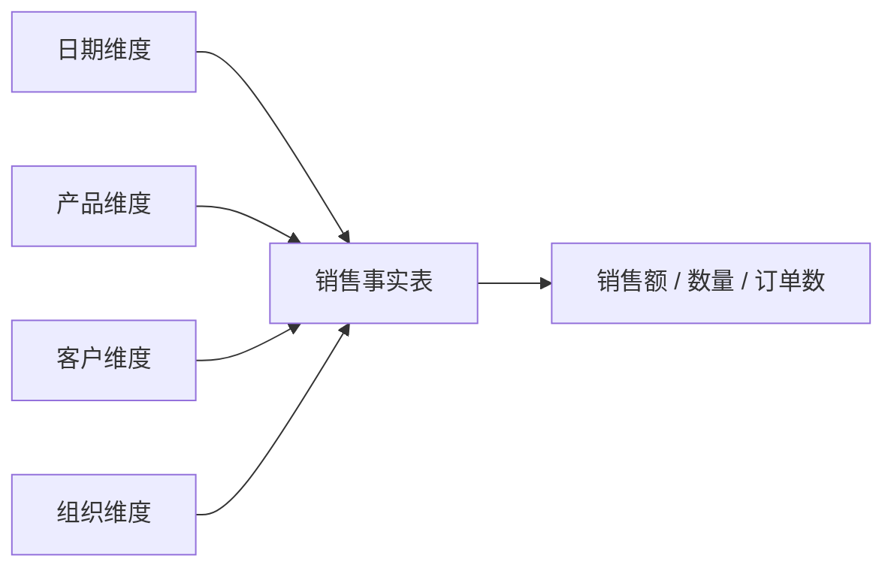
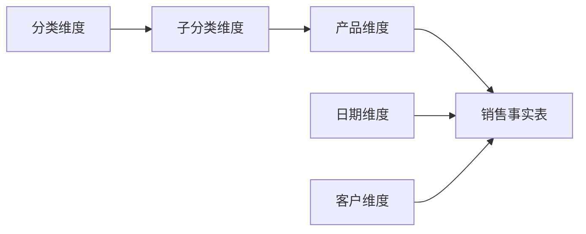
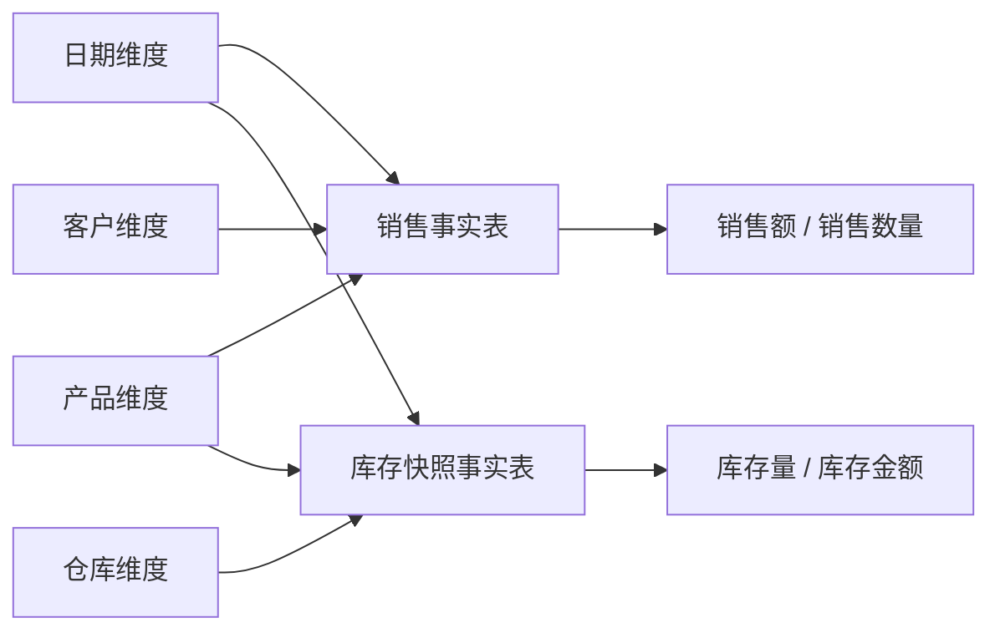

# BI 产品建模最佳实践

## 1. 文档目标

在 Power BI、Tableau、Looker、Wyn 等 BI 产品中，建模通常不是简单地把数据库表拖进画布，然后配置几条关联。真正影响 Dashboard 是否可信、是否好用、是否能长期维护的，是事实表、维度表、指标口径、筛选方向和权限语义是否设计清楚。

这些 BI 工具提供了模型视图、关系编辑器、语义层、度量值、直连查询和权限过滤等能力，但工具本身不会自动替我们判断业务粒度是否正确、关系路径是否有歧义、指标是否会重复计算。Power BI 中关系方向配置不当、Tableau 中数据源关系边界不清、Looker 中语义层定义混乱，最后都会导致同一类问题：报表能打开，但结果难解释，筛选不稳定，性能也越来越不可控。

本文用于指导 BI 产品直连查询场景下的数据模型设计。目标是把通用 BI 建模经验沉淀为实践规则，帮助模型设计人员创建稳定、清晰、可复用、性能可控的数据模型。

一个好的 BI 产品直连查询模型应满足以下要求：

- Dashboard 作者能够直接理解模型中的表、字段、关系和指标。
- 度量值在不同维度下聚合结果正确，不因关联或关系配置产生重复计算。
- 关系方向清楚，筛选传播路径可解释，不存在循环或歧义路径。
- 模型规模适中，直连查询不会把过重计算全部压到运行时。
- 权限、安全过滤、显示所有维度等能力与业务语义一致。

## 2. 建模前先确定模型边界

建模前应先明确模型服务的业务范围。不要一开始就把数据库中的所有表都放进同一个模型。

建议先回答以下问题：

- 这个模型面向哪个业务主题，例如销售、库存、财务、生产、客户、设备监控。
- Dashboard 主要展示哪些指标。
- 指标来自哪些业务事件、流水、汇总或状态快照。
- 用户需要按哪些维度筛选、分组、钻取和对比。
- 是否需要跨多个事实主题分析。
- 是否有部门、区域、客户、租户等权限过滤要求。
- 数据是否要求实时或准实时展示。
- 查询量、数据量和交互频率是否适合直连查询。

模型边界越清楚，后续事实表、维度表、关系和指标定义就越稳定。若一个模型同时覆盖过多业务主题，关系会快速变复杂，Dashboard 作者也更容易误用字段。

## 3. 核心建模原则

BI 产品直连查询模型应优先遵循以下原则：

- 先定义业务粒度，再配置表关系。
- 事实表承载业务事件和度量，维度表承载筛选、分组、展示和层级。
- 优先使用星型架构；雪花、事实星座和宽表只在适合的场景使用。
- 默认让筛选从维度传播到事实，谨慎使用双向筛选。
- 多事实分析通过共享维度或汇总表完成，不直接把事实表互相关联。
- 指标口径集中维护，避免同名指标在不同 Dashboard 中算法不同。
- 复杂清洗、重计算和高频聚合优先前置到数据库视图、中间表、汇总表或物化视图。

## 4. 表角色设计

BI 模型中的表不应只被理解为数据库表，还应被理解为业务语义对象。每张表都应有清楚的角色。

### 4.1 事实表

事实表用于存储业务事件、流水、状态记录、快照或可聚合的度量数据。常见例子包括销售订单明细、付款流水、库存快照、生产记录、设备采集数据、汇率记录、温度记录。

事实表通常具备以下特征：

- 行数较多，并且会随着时间持续增长。
- 包含一个或多个外键，用于关联维度表。
- 包含可聚合的数值字段，例如金额、数量、时长、成本、次数。
- 每一行代表明确的业务粒度。

事实表设计的第一件事是定义粒度。粒度表示事实表中“一行数据代表什么”。例如：

- 一行代表一条销售订单明细。
- 一行代表一个设备在一分钟内的一次采集结果。
- 一行代表某商品在某仓库某天的库存快照。
- 一行代表某客户某月的一次账单。

如果事实表粒度不清楚，后续聚合、关联、筛选和指标计算都容易出错。

常见事实表类型包括：

- 交易事实：记录业务事件明细，例如订单行、付款流水、出库明细。
- 周期快照事实：按固定周期记录状态，例如每日库存、每月余额。
- 累积快照事实：记录一个流程从开始到结束的多个阶段，例如订单从创建、发货到完成的过程。

不同事实类型的聚合方式不同。交易事实通常更适合求和、计数；周期快照事实要特别注意不能跨时间简单求和。

### 4.2 维度表

维度表用于描述事实数据的分析上下文。常见例子包括产品、客户、地区、部门、员工、日期、分类、供应商、设备、项目。

维度表通常具备以下特征：

- 有唯一键，用于被事实表外键引用。
- 包含描述性字段，用于筛选、分组、展示和层级分析。
- 字段更多是名称、分类、状态、区域、层级、属性，而不是业务流水。
- 行数通常小于事实表，但客户、商品、设备等大维度也可能很大。

维度字段适合放在 Dashboard 的维度、分类、筛选器、分组、图例、行列标题中。事实表字段则更适合作为度量值来源。

如果维度属性会随时间变化，需要明确是否保留历史：

- 如果只关心当前属性，可以直接更新维度属性。
- 如果需要按历史属性还原当时业务状态，应为维度版本、有效期或历史快照设计字段，并确保事实记录关联到正确版本。

### 4.3 日期维度

日期维度是最常用的公共维度之一。建议为重要业务时间建立标准日期维度，例如订单日期、发货日期、付款日期、采集日期。

日期维度可包含：

- 日期、年、季度、月、周、日。
- 财年、财季、财月。
- 工作日、节假日、周末标记。
- 月初、月末、季度初、季度末。

如果一个事实表有多个日期字段，应根据业务含义设计角色，例如订单日期、发货日期、完成日期。不要让多个日期关系同时造成筛选路径混乱。

### 4.4 桥表

桥表用于处理多对多关系。例如一个客户属于多个客户组，一个用户属于多个部门，一个商品拥有多个标签。

桥表通常保存两侧实体的键，以及必要的权重、有效期或关系属性。它不应被当作普通事实表随意拖取度量，也不应被隐藏在复杂双向筛选中。

使用桥表时要明确：

- 桥表的一行代表什么关系。
- 桥表是否有权重字段。
- 桥表是否有有效期。
- 桥表两侧是否会造成重复计数。
- Dashboard 是否需要直接展示桥表字段。

### 4.5 权限表

权限表用于安全过滤，例如用户与部门、用户与客户、用户与区域、角色与数据范围之间的关系。

权限表应保持结构简单、字段稳定，并尽量使用可索引字段。权限表不要与业务事实混在一起，否则权限逻辑会变得难以维护。

## 5. 架构选择

BI 模型不只有星型和雪花两种选择。实际建模时还可能用到事实星座、宽表、汇总模型或上游规范化模型。关键不是架构名称，而是该结构是否能保证聚合正确、路径清晰、性能可控。

| 架构 | 适合场景 | 是否推荐作为 BI 消费模型 |
| --- | --- | --- |
| 星型架构 | 一个或多个事实表围绕清晰维度分析，Dashboard 作者需要直接消费模型 | 默认推荐 |
| 雪花架构 | 源数据高度规范化，维度层级需要复用或独立维护 | 可以使用，但要控制路径复杂度 |
| 事实星座/多星型架构 | 多个事实表共享日期、产品、客户、组织等公共维度 | 推荐用于多事实分析 |
| 宽表/扁平模型 | 单一主题、单一粒度、字段组合固定、性能优先 | 可用于简单场景，不适合复杂复用模型 |
| 汇总/预聚合模型 | 大数据量、高频 Dashboard、固定分析粒度 | 推荐作为性能优化补充 |
| 高度规范化源模型 | 数据库三范式、历史建模、上游数据准备层 | 不建议直接作为 Dashboard 消费模型 |

### 5.1 星型架构

星型架构是 BI 建模的默认推荐结构。事实表位于中心，维度表直接连接事实表。

星型架构适合以下场景：

- Dashboard 主要围绕事实指标进行多维分析。
- 维度层级不深，或可以在维度表中展开。
- 查询性能和模型可理解性优先。
- 业务用户需要直接选择字段创建图表。

星型架构的优点是关系简单、查询路径短、筛选传播清楚、聚合更不容易出错。它可能带来一定维度冗余，但在分析场景中通常可以接受。

### 5.2 雪花架构

雪花架构是在维度表基础上继续拆分层级表。例如销售事实表关联产品表，产品表再关联子分类表，子分类表再关联分类表。

雪花架构适合以下场景：

- 源数据库本身高度规范化。
- 维度层级需要被多个模型或多个维度复用。
- 维度表体量大，拆分后更利于维护。
- 业务上确实需要保留原始层级结构。

使用雪花架构时要控制复杂度：

- 层级路径应唯一，不要让同一个事实表通过多条路径到达同一维度。
- 不要形成循环关系。
- 不要让 Dashboard 作者在多个层级表之间猜测应该使用哪个字段。
- 高频使用的多层维度可以整理为一个更易消费的维度表或数据库视图。

### 5.3 事实星座/多星型架构

事实星座适合多个事实表共享公共维度的场景。例如销售事实、库存事实、回款事实共享日期、产品、组织等维度。

事实星座是多事实分析的推荐结构，但必须注意：

- 不直接把事实表互相关联。
- 使用共享维度连接多个事实表。
- 共享维度在各事实表中的业务含义必须一致。
- 不同粒度事实表只能在共同粒度上比较。
- 跨事实指标应有明确计算口径，必要时提前生成统一汇总表。

### 5.4 宽表/扁平模型

宽表可以减少关联次数，但如果把多个不同粒度的事实或互相独立的维度强行合并，容易造成数据复制和聚合错误。

宽表适合以下场景：

- 单一业务主题。
- 单一事实粒度。
- Dashboard 字段组合固定。
- 数据量或性能要求使运行时关联成本不可接受。
- 上游已经保证宽表口径正确。

不建议为了“方便拖字段”而把所有表关联成一个大宽表。只要存在多个事实粒度、多个互不相关的维度或多对多关系，就应优先回到星型、雪花或事实星座结构。

### 5.5 汇总/预聚合模型

汇总或预聚合模型适合高频访问、大数据量、固定分析粒度的 Dashboard。例如每日销售汇总、月度库存汇总、区域客户数汇总。

使用汇总模型时要注意：

- 汇总粒度必须清楚。
- 汇总指标与明细指标口径一致。
- Dashboard 不应把汇总表当成明细事实表使用。
- 如果同时存在明细表和汇总表，要避免用户在同一图表中混用不兼容粒度。

### 5.6 高度规范化源模型

数据库三范式、历史建模或更复杂的上游数据结构适合作为数据准备层，但通常不适合作为业务用户直接消费的 BI 模型。

如果直接把高度规范化的源结构暴露给 Dashboard 作者，常见问题包括：

- 表数量过多，字段含义难以理解。
- 关联路径过长，查询性能下降。
- 多条路径导致筛选含义不清。
- 指标口径分散在多个表和计算中。

更合适的做法是先通过视图、中间表、汇总表或语义整理，将源结构转换为更接近星型、雪花或事实星座的消费模型。

## 6. 关系设计

### 6.1 正确配置基数

关系基数决定筛选和聚合的语义。最常见、最稳定的关系是一对多或多对一。

通常情况下：

- “一”侧是维度表，主键或唯一键必须唯一。
- “多”侧是事实表，外键可以重复。
- 维度表筛选事实表。
- 事实表提供度量值。

配置关系前应验证：

- “一”侧字段是否真的唯一。
- “多”侧字段是否存在大量无法匹配的值。
- 是否存在 null、空字符串或异常外键。
- 关系字段的数据类型是否一致。
- 关系字段是否适合建立索引。

一对一关系并不常见。如果模型中出现大量一对一关系，应检查是否存在不必要的拆表，或是否可以合并为同一维度。

### 6.2 谨慎处理多对多关系

多对多关系是最容易导致重复计算的来源。不要仅靠双向筛选解决多对多问题。

推荐做法：

- 使用桥表显式表达多对多。
- 明确桥表粒度。
- 必要时在桥表中加入权重，避免金额、数量被重复分摊。
- 对多对多指标单独定义计算逻辑。
- 在 Dashboard 中避免让用户随意组合容易重复计数的字段。

如果无法清楚解释一条多对多关系的过滤路径和聚合结果，就不应把它作为普通关系暴露给业务用户。

### 6.3 避免事实表直接关联事实表

多个事实表通常有不同粒度。例如销售明细、库存快照、客户拜访记录、付款流水，它们不应直接互相关联。

更稳妥的方式是：

- 通过共享维度进行分析，例如日期、客户、产品、区域。
- 在相同粒度下提前生成汇总表。
- 使用桥表或中间表表达明确业务关系。
- 对跨事实指标建立专门的数据准备逻辑。

直接连接两个事实表通常会产生行数膨胀，导致金额、数量、次数等指标被重复计算。

### 6.4 控制关系路径

一个模型中从某个维度到某个事实表最好只有一条明确路径。如果存在多条路径，系统和用户都可能难以判断筛选应该如何传播。

应避免：

- 循环关系。
- 多条等价筛选路径。
- 事实表之间互相关联后再连接共享维度。
- 大量双向关系交织在一起。
- 同一业务含义的字段散落在多张表中。

如果模型关系图像一张复杂网络，而不是清楚的星型、雪花或事实星座结构，就应该重新拆分模型或整理上游数据。

## 7. 筛选方向

### 7.1 默认从维度过滤事实

BI 建模中，筛选方向应优先采用从维度侧到事实侧的单向传播。也就是用户选择产品、客户、日期、区域等维度后，过滤对应事实表中的销售额、数量、成本等度量。

这种方向最符合业务分析习惯，也最容易解释。

### 7.2 谨慎使用双向筛选

双向筛选会让关系两侧都能互相过滤，短期看能解决联动问题，但也可能带来路径歧义、性能下降和难以解释的结果。

只有满足以下条件时才建议使用双向筛选：

- 业务上确实需要从两侧互相筛选。
- 模型中不存在循环路径。
- 不会形成多条传播路径。
- 已验证聚合结果不会重复计算。
- Dashboard 作者能够理解该关系的含义。

如果开启双向筛选只是为了让某个筛选器“看起来能联动”，应优先考虑调整模型结构。

### 7.3 显示所有维度

“显示所有维度”用于展示没有事实记录匹配的维度成员。例如展示所有产品，即使某些产品没有销售额。

使用该能力时要确认：

- 展示基准是维度表，而不是事实表。
- 没有事实数据的成员应显示为空、0，还是其他默认值。
- 权限过滤不会暴露用户不应看到的维度成员。
- 维度表中不存在无效、重复或过期成员。

## 8. 指标设计

### 8.1 度量值应来自事实表

金额、数量、次数、时长、成本、库存、温度、汇率等度量值通常应来自事实表。维度表上的数值字段如果被用于聚合，要先确认它是否真的具备度量含义。

建议在模型层统一定义常用指标，减少 Dashboard 作者重复配置。

常见指标包括：

- 销售额：Sum(Amount)
- 销售数量：Sum(Quantity)
- 订单数：Count(OrderID)
- 客户数：CountDistinct(CustomerID)
- 平均客单价：销售额 / 订单数
- 毛利率：毛利额 / 销售额

### 8.2 明确指标可加性

不是所有指标都能随意求和。

指标可分为：

- 可加指标：销售额、数量、成本、次数，通常可以按多个维度求和。
- 半可加指标：库存余额、账户余额、设备状态，通常不能跨时间直接求和。
- 不可加指标：比率、百分比、均值、温度、单价，通常需要专门计算公式。

对半可加和不可加指标，应在模型或说明中标明使用限制，避免 Dashboard 中误聚合。比率类指标应优先用分子和分母重新计算，不要直接对各分组比率求平均。

### 8.3 指标口径应集中维护

同一个业务指标不应在不同 Dashboard 中有不同计算方式。

建议：

- 把高频指标定义在模型层。
- 指标命名体现业务含义和聚合方式。
- 对比率指标明确分子、分母和过滤条件。
- 对时间相关指标明确统计周期。
- 对权限相关指标确认安全过滤后结果是否正确。

## 9. 字段治理

### 9.1 隐藏技术字段

业务用户通常不需要直接看到代理键、外键、系统 ID、审计字段、同步字段、删除标记等技术字段。

建议隐藏：

- 内部主键、外键。
- 创建时间、更新时间、同步批次等技术字段，除非业务需要分析。
- 数据库维护字段。
- 不应被直接拖拽的桥表字段。
- 权限辅助字段。

### 9.2 使用清晰命名

字段名称应面向 Dashboard 作者和业务用户，而不是只面向数据库开发人员。

建议：

- 使用业务可理解的显示名。
- 避免缩写过多。
- 对金额、数量、百分比、日期、状态字段使用一致命名。
- 同一含义字段在不同表中命名保持一致。
- 对容易混淆的字段添加说明。

### 9.3 建立层级

常用维度层级应在模型中清晰表达，例如：

- 分类 > 子分类 > 产品
- 国家 > 省份 > 城市
- 公司 > 部门 > 员工
- 年 > 季度 > 月 > 日

层级可以帮助 Dashboard 作者正确钻取，也能减少误选字段。

## 10. 权限与安全过滤

安全过滤器用于控制不同用户看到的数据范围。它应作为模型设计的一部分，而不是最后临时补丁。

设计安全过滤器时应注意：

- 权限逻辑应建立在稳定维度上，例如部门、区域、客户、租户、组织。
- 权限字段应尽量有索引。
- 用户属性变量应有明确默认策略。
- 权限表与业务事实表应保持清晰关系。
- 权限过滤后仍要测试指标聚合是否正确。
- 与“显示所有维度”一起使用时，要防止出现无权限维度成员。

如果权限规则很复杂，应优先在数据库视图、权限表或上游数据准备中整理，再进入 BI 模型。

## 11. 直连查询性能实践

直连查询的优势是可以展示最新数据，减少缓存和数据复制。但直连查询也更依赖数据库查询性能。

### 11.1 适合直连查询的场景

直连查询更适合：

- 数据需要实时或准实时展示。
- 数据库本身查询能力较好。
- Dashboard 交互路径相对明确。
- 数据无需复杂清洗转换。
- 查询返回数据量可控。
- 用户更关注最新结果，而不是复杂离线分析。

### 11.2 不适合全部交给直连的场景

以下场景应考虑缓存、聚合表、数据库视图、物化视图或上游数据准备：

- 大量复杂关联。
- 大量运行时计算字段。
- 多事实表复杂组合。
- 高频访问超大事实表。
- 需要复杂权限推导。
- 每次查询都扫描大量历史数据。
- Dashboard 同时加载大量图表。

### 11.3 数据库侧优化

直连查询模型的性能很大程度取决于数据库侧准备。

建议：

- 为事实表外键建立索引。
- 为维度表主键或唯一键建立索引。
- 为常用日期、组织、区域、客户等筛选字段建立索引。
- 避免在关联字段上使用不必要的类型转换。
- 尽量使用整数键或稳定业务键进行关联。
- 将复杂清洗和转换前置到数据库视图或中间表。
- 对高频聚合建立汇总表或物化视图。

### 11.4 模型侧优化

BI 模型侧也应控制复杂度：

- 不暴露无关字段。
- 不引入无关表。
- 不创建过多嵌套 Custom SQL。
- 避免让一个 Dashboard 同时触发大量重查询。
- 高频使用路径尽量采用短关联路径。
- 对复杂模型按业务主题拆分。

## 12. 常见反模式

以下做法应尽量避免：

- 不区分事实表和维度表，所有表都当普通表使用。
- 把多个不同粒度事实强行关联成宽表。
- 在事实表之间直接建立关系。
- 多对多关系没有桥表或计算规则。
- 大量开启双向筛选。
- 模型中存在循环路径。
- “一”侧字段并不唯一。
- 指标散落在不同 Dashboard 中重复定义。
- 同名指标在不同图表中口径不同。
- 把复杂清洗、转换、权限推导全部放在直连运行时。
- 暴露大量技术字段给 Dashboard 作者。
- 只追求字段齐全，不考虑用户是否能理解和正确使用。

## 13. 建模检查清单

发布模型前建议逐项检查：

- 模型业务主题是否清楚。
- 每张表是否有明确角色。
- 每张事实表是否定义了粒度。
- 每张维度表是否有唯一键。
- 度量值是否主要来自事实表。
- 维度字段是否主要来自维度表。
- 每条关系的“一”侧是否真的唯一。
- 是否存在事实表直接连接事实表。
- 是否存在未处理的多对多关系。
- 是否存在循环路径或多条筛选路径。
- 筛选方向是否默认从维度到事实。
- 双向筛选是否有明确业务理由。
- 是否需要显示没有事实数据的维度成员。
- 指标口径是否集中维护。
- 半可加和不可加指标是否有说明。
- 权限过滤是否基于稳定字段。
- 权限过滤是否与显示所有维度一起测试过。
- 技术字段是否已隐藏。
- 字段命名和说明是否面向业务用户。
- 高频查询路径是否尽量短。
- 关系键、筛选字段、权限字段是否有索引。
- 大数据量或复杂查询是否有缓存、视图、汇总表或物化方案。

## 14. 推荐落地流程

建议按以下流程设计 BI 产品直连查询模型：

1. 明确业务主题和 Dashboard 使用场景。
2. 列出核心指标，并确定指标来源事实表。
3. 为每张事实表定义粒度。
4. 列出分析维度和权限维度。
5. 选择星型、雪花、事实星座、宽表或汇总模型。
6. 配置关系、基数和筛选方向。
7. 验证“一”侧唯一性和外键匹配情况。
8. 定义常用指标和字段显示名。
9. 隐藏技术字段和不应直接使用的字段。
10. 配置安全过滤器。
11. 使用典型 Dashboard 场景验证聚合结果。
12. 使用大数据量场景验证直连查询性能。
13. 根据验证结果调整模型或上游数据准备。

## 15. 总结

BI 产品直连查询建模的核心不是把数据库表全部连接起来，而是把业务事实、分析维度、指标口径、权限规则和查询路径组织成一个稳定的语义模型。

最稳妥的默认策略是：以事实表承载度量，以维度表承载筛选和分组，以清晰的一对多关系连接二者，以单向筛选保证路径可解释，以统一指标保证口径一致，以数据库侧准备和索引保证直连性能。

当模型足够清楚时，Dashboard 作者不需要理解复杂数据库结构，也能基于模型创建正确、稳定、可复用的分析内容。
