# 在Windows上安装DM8

## 下载安装镜像

1. 访问官网下载安装镜像

[https://www.dameng.com/](https://www.dameng.com/)

2. 解压压缩包

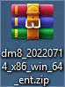

## 安装 DM8

1. 运行安装程序

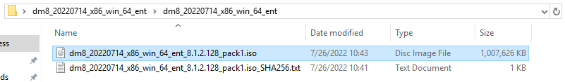

2. 启动目录中的setup.exe

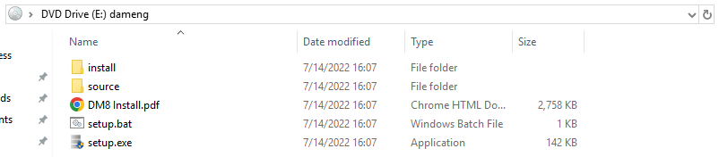

3. 语言与时区选择

根据系统配置选择相应的语言与时区，点击OK按钮继续安装。

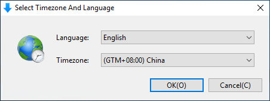

4. 欢迎页面

点击Next按钮继续安装。

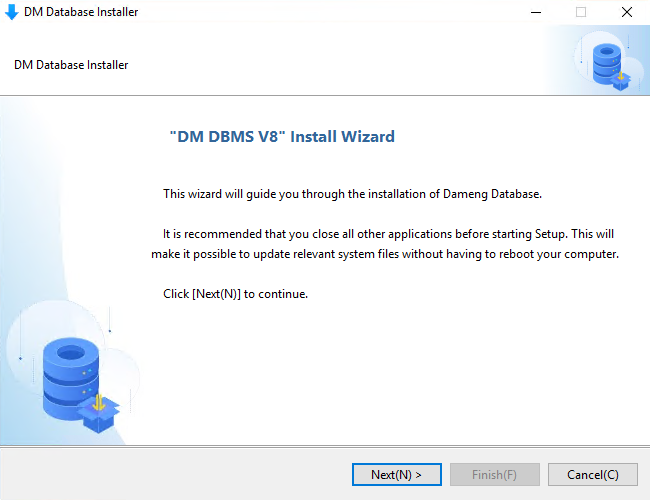

5. 许可证协议

选择接受协议，并点击Next继续安装。

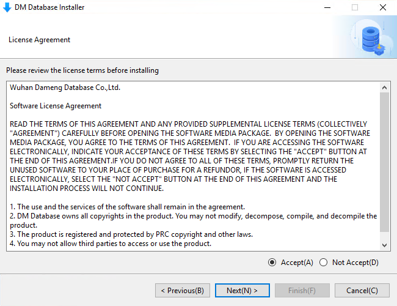

6. 验证Key文件

直接点击Next，继续安装

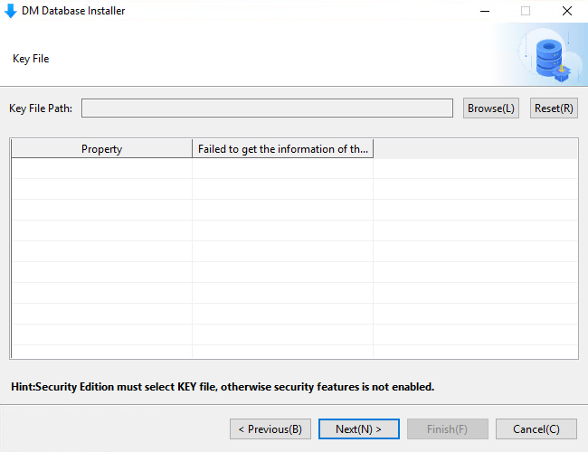

7. 选择安装组件

DM 安装程序提供四种安装方式：“典型安装”、“服务器安装”、“客户端安装”和“自定义安装”，用户可根据实际情况灵活地选择。如下图所示：

典型安装包括：服务器、客户端、驱动、用户手册、数据库服务。

服务器安装包括：服务器、驱动、用户手册、数据库服务。

客户端安装包括：客户端、驱动、用户手册。

自定义安装包括：用户根据需求勾选组件，可以是服务器、客户端、驱动、用户手册、数据库服务中的任意组合。

选择后点击Next继续安装。

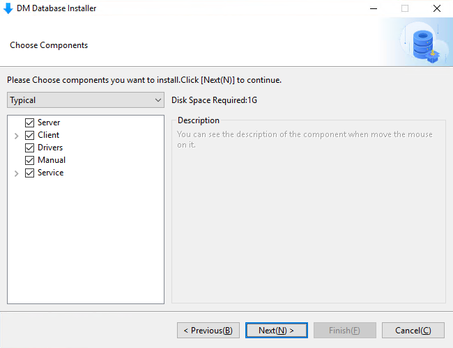

8. 选择安装目录

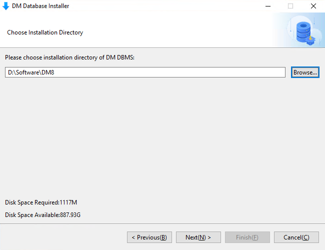

9. 安装前小结

显示用户即将进行的安装的有关信息，例如产品名称、版本信息、安装类型、安装目录、可用空间、可用内存等信息，用户检查无误后点击Install按钮进行DM的安装。

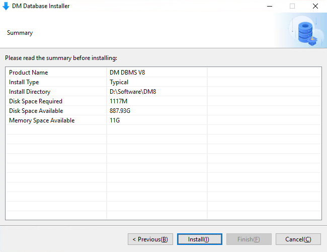

10. 安装过程

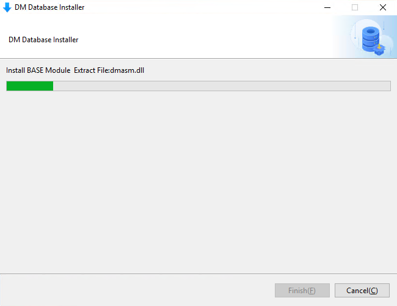

等待安装完毕。

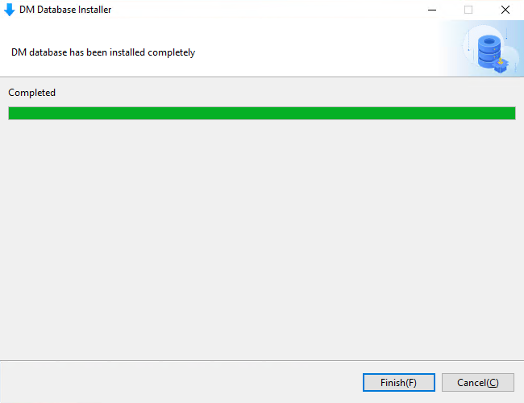

## 初始化数据库

1. 初始化数据库

安装完成后，可以点击Init进行数据库的初始化。

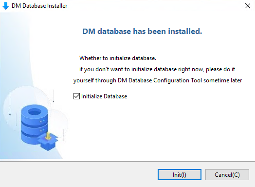

2. 选择操作方式

选择Create Database Instance并点击Start。

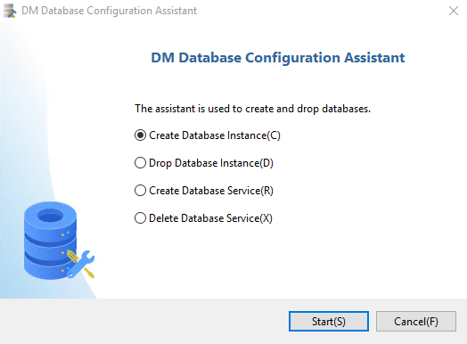

3. 创建数据库模板

系统提供三套数据库模板供用户选择：一般用途、联机分析处理和联机事务处理，用户可根据自身的用途选择相应的模板。

选择Common并点击Next继续。

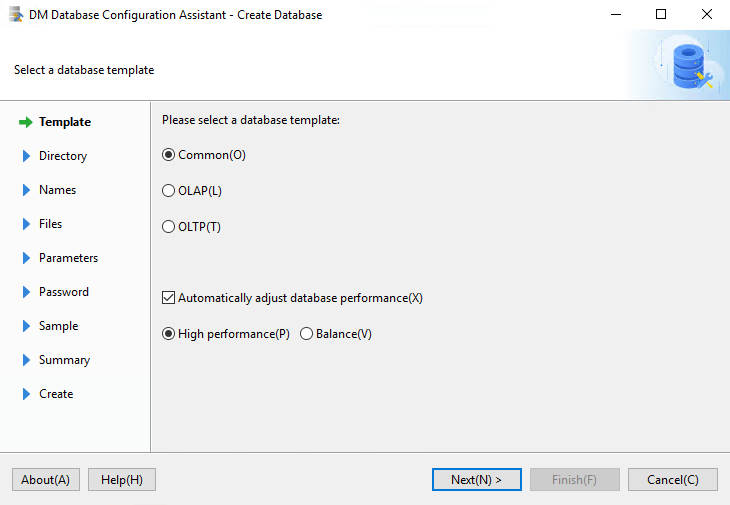

4. 选择数据库目录

设置数据库目录后点击Next继续。

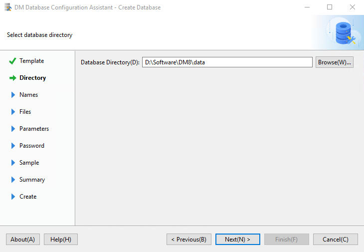

5. 输入数据库标识

用户可输入数据库名称、实例名、端口号等参数。

点击Next继续。

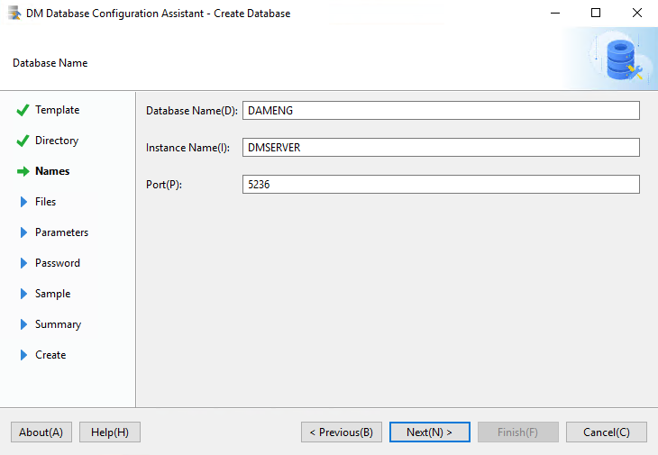

6. 数据库文件所在位置

用户可通过选择或输入确定数据库控制、数据库日志等文件的所在位置，并可通过右侧功能按钮，对文件进行添加或删除。

点击Next继续。

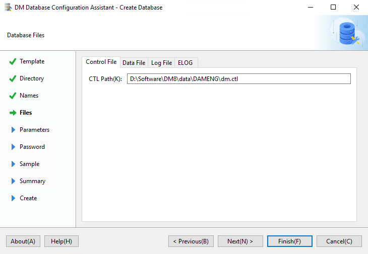

7. 数据库初始化参数

用户可输入数据库相关参数，如簇大小、页大小、日志文件大小、选择字符集、是否大小写敏感等。

点击Next继续。

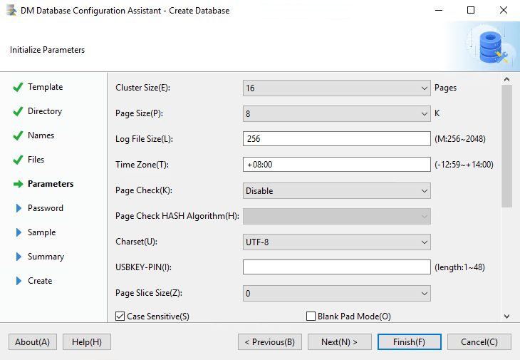

8. 口令管理

用户可输入 SYSDBA，SYSAUDITOR 的密码，对默认口令进行更改，如果安装版本为安全版，将会增加 SYSSSO 用户的密码修改。

点击Next继续。

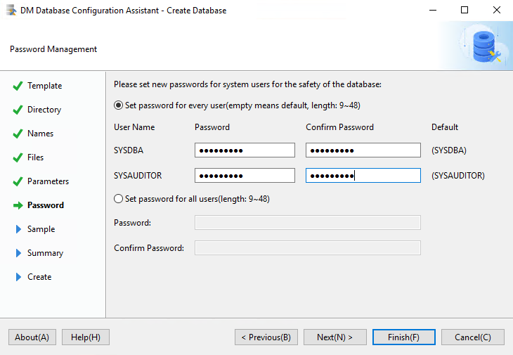

9. 选择创建示例库

用户可选择是否创建示例库 BOOKSHOP 或 DMHR。

点击Next继续。

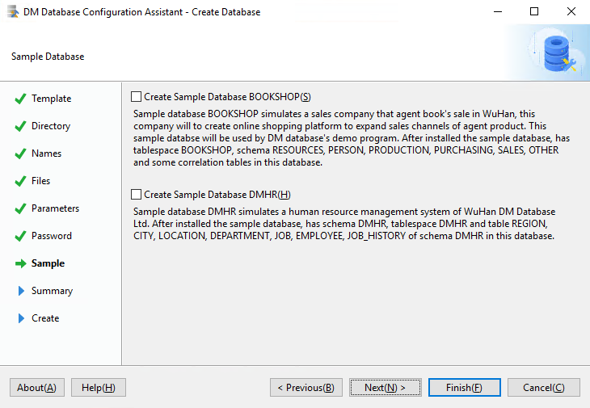

10. 创建数据库摘要

在安装数据库之前，将显示用户通过数据库配置工具设置的相关参数。

点击Finish继续。

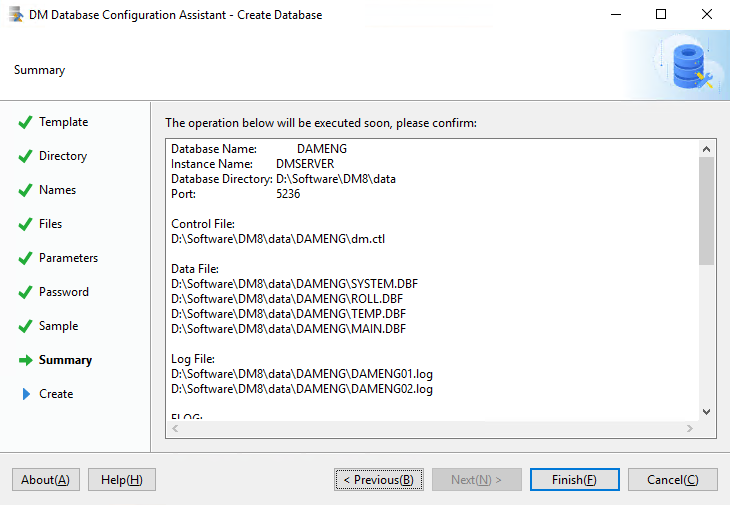

11. 安装初始化数据库

等待安装完成。

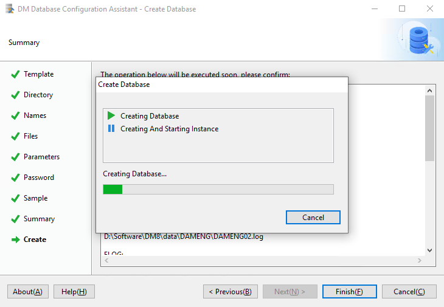

安装完成后将弹出数据库相关参数及文件位置。

点击Finish完成初始化数据库。

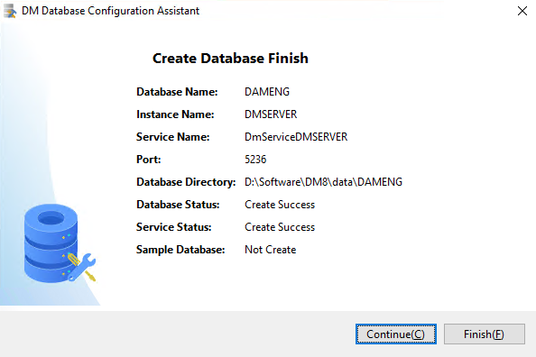