# 在CentOS7上安装MySQL-5.7

当时安装mysql5.7遇到很多问题，网上解决办法都不对，记录下来自己安装成功的安装步骤及注意事项

## 安装mysql5.7

### 更新yum本地缓存

```bash
yum clean cache
yum makecache
```

### 查看系统中是否已安装mysql

```bash
yum list installed | grep mysql
```

### 卸载系统自带的mysql及其依赖（防止冲突）

```bash
yum -y remove mysql-libs.x86_64
```

### 安装wget

```bash
yum install wget -y
```

### 给centos添加rpm源，并且选择比较新的源

```bash
wget dev.mysql.com/get/mysql-community-release-el6-5.noarch.rpm
```

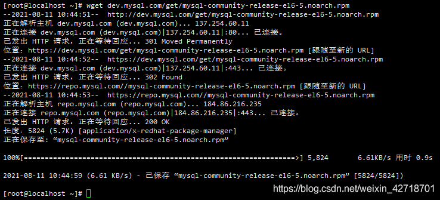

### 安装下载好的rpm文件

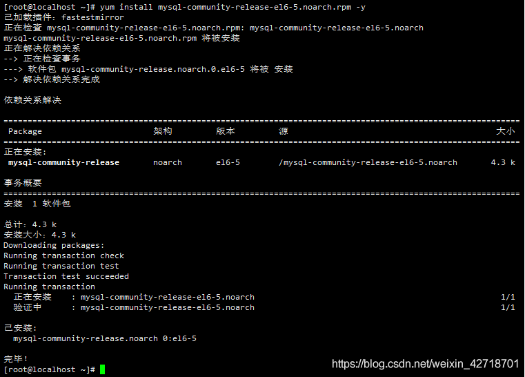

### 进入目录/etc/yum.repos.d/会多出这两个文件

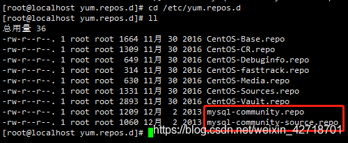

### 修改mysql-community.repo文件

```bash
vi mysql-community.repo
```

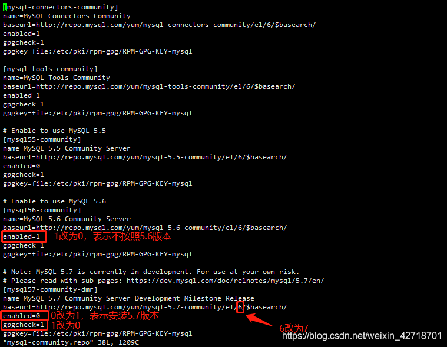

### 使用yum安装mysql

```bash
yum install mysql-community-server -y
```

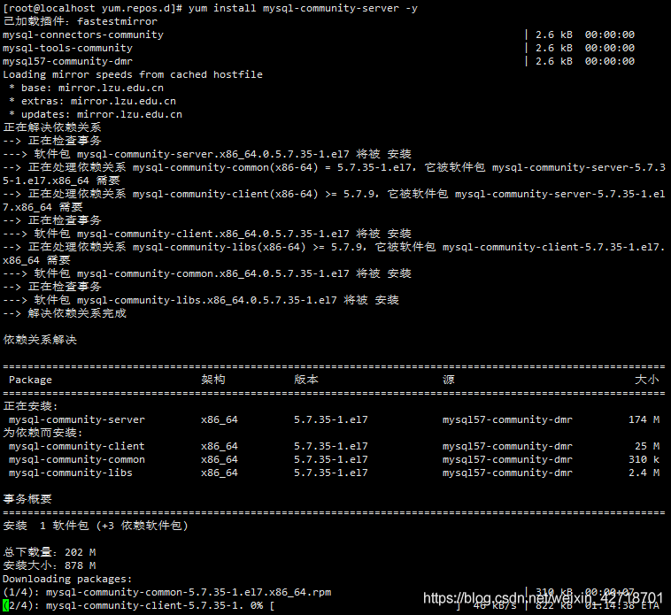

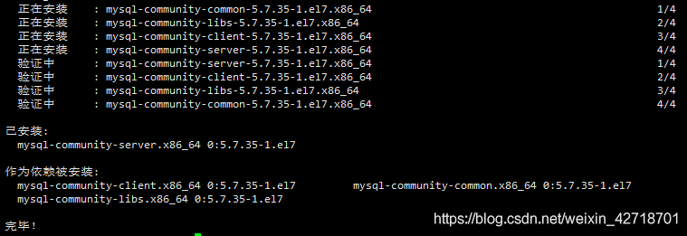

### 查看下mysql的版本，确定是否安装成功

```bash
mysql -V
```


### 启动mysql服务

```bash
service mysqld start
```


### 设置mysql开机启动

```bash
chkconfig mysqld on
```

### 从mysqld.log文件中，查看mysql临时密码

```bash
grep "password" /var/log/mysqld.log
```

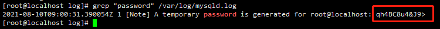

### 复制上面的临时密码，登录mysql

```bash
mysql -uroot -p临时密码
```

- 如果临时密码中有特殊字符，需要加上 \\\\ 转义，不然会提示字符异常
- -u 和-p后面不要有空格，不然会提示密码错误

### 修改密码验证策略(不更改，可能修改的密码通不过)，然后更改root用户密码

```sql
set global validate_password_policy=0;
set global validate_password_length=4;
alter user 'root'@'localhost' identified by '123456';
```


- 修改密码成功后，输入quit退出，然后使用新密码重新登录。

### 设置数据库用户在所有ip下都可以访问，以下用root用户示例（mysql中输入该命令）

```sql
grant all privileges on *.* to 'root'@'%' identified by '123456' with grant option;
```

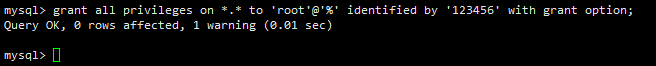

- 其中root为用户，%表示所有权限，密码为123456

### 刷新mysql的系统权限相关表（mysql中输入该命令）

```sql
flush privileges;
```


### 使用quit或exit退出mysql，重启mysql服务

```bash
service mysqld restart
```

## 开启防火墙

linux防火墙默认是没有开通3306端口的，需要手动开通，这样本地客户端才能连接上linux上的mysql服务。

### 查询3306端口是否开启

```bash
firewall-cmd --query-port=3306/tcp
```


- yes，表示开启；no表示未开启

### 在防火墙上，添加需要开放的3306端口

```bash
firewall-cmd --add-port=3306/tcp --permanent
```


### 重载入添加的端口

```bash
firewall-cmd --reload
```


### 再次查询3306端口是否开启，确认已开启

```bash
firewall-cmd --query-port=3306/tcp
```


## 卸载linux上的mysql

如果安装失败，想重新安装，则需要将mysql相关的全部删除掉。

### 检查安装的mysql组件

```bash
rpm -qa | grep -i mysql
```

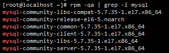

### 将查询出来的文件逐个删除

```bash
yum remove mysql-community-libs-compat-5.7.35-1.el7.x86_64
yum remove mysql-community-release-el6-5.noarch
yum remove mysql-community-common-5.7.35-1.el7.x86_64
```

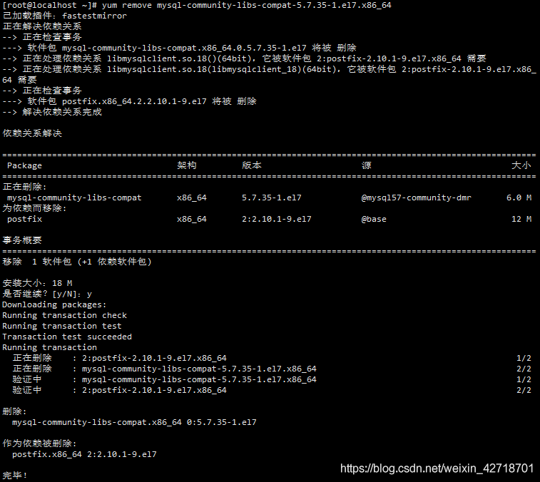

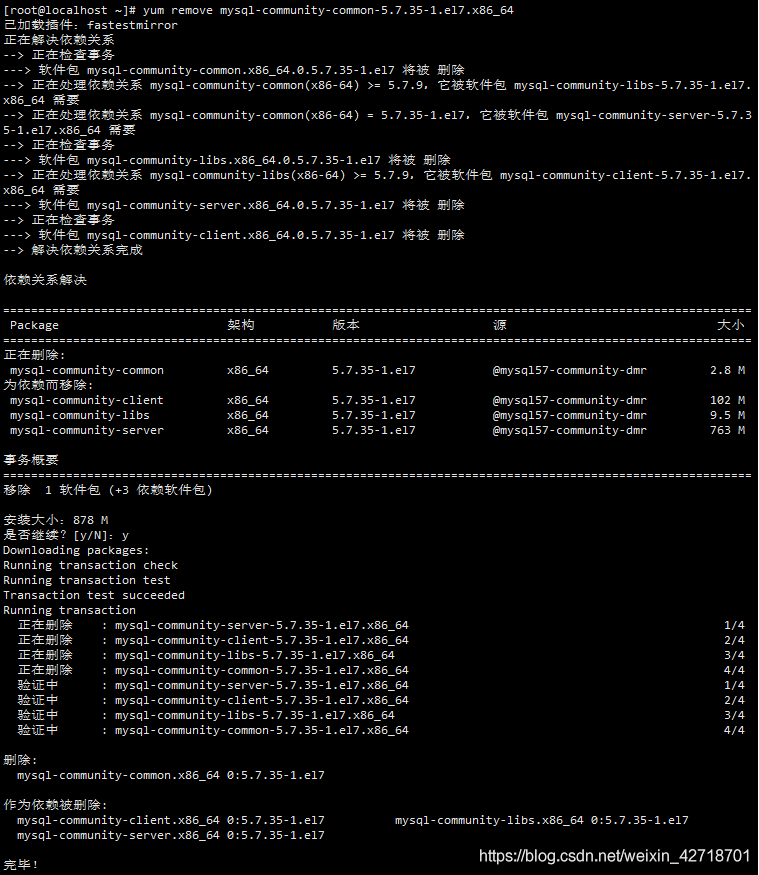

### 删除mysql相关文件

```bash
yum remove mysql mysql-server mysql-libs mysql-server
rm -rf /var/lib/mysq
rm /etc/my.cnf
rm –rf /usr/lib64/mysql
rm -rf /etc/yum.repos.d/mysql*
rm -rf mysql-community-release-el6-5.noarch.rpm
```

### 查找残留目录，然后使用rm命令逐一删除

```bash
whereis mysql
```