# Install Oracle-12c-R2 on Windows

Oracle Download Address:
[https://edelivery.oracle.com/osdc/faces/SoftwareDelivery](https://edelivery.oracle.com/osdc/faces/SoftwareDelivery)

## Log in to your Oracle account

Open the Oracle download address connection, enter the Oracle account password login (if you do not have an account, please register an account first)


## Download the installation package

1. Enter the following text in the search box to search for installers

```
Oracle Database 12c Enterprise Edition
```

2. Select a version of the installation package as follows

```
Oracle Database 12c Personal Edition 12.1.0.2.0
```

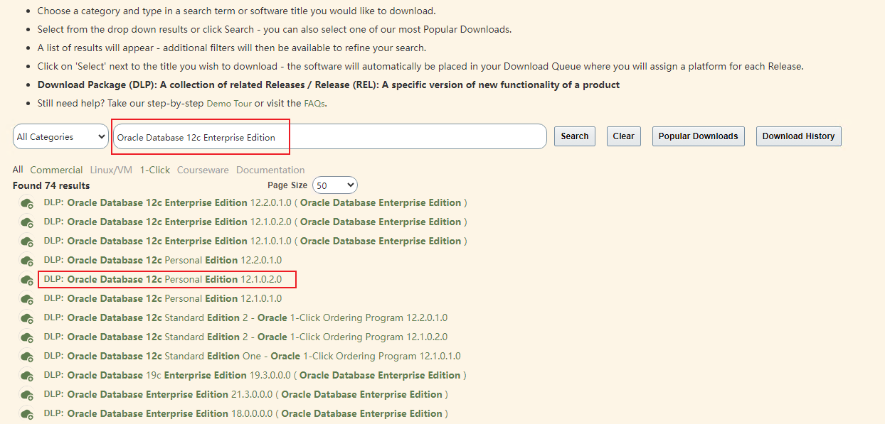

3. Click on View Items in the upper right

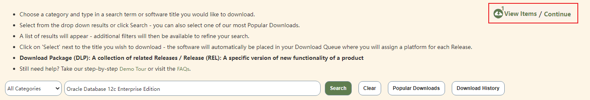

4. Select the corresponding installation environment and language, confirm and click Continue.

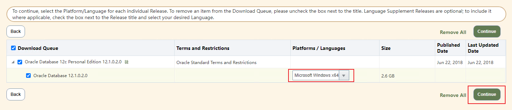

5. Select Agree and click Continue

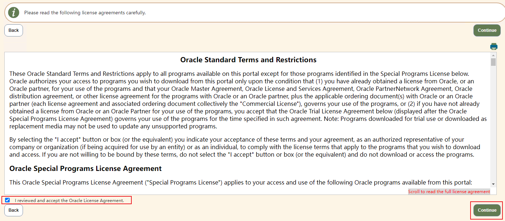

6. Click to Download

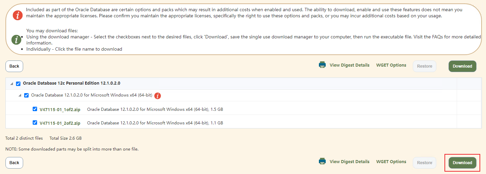

7. Open the downloaded downloader

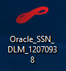

8. Select the download path and click Next

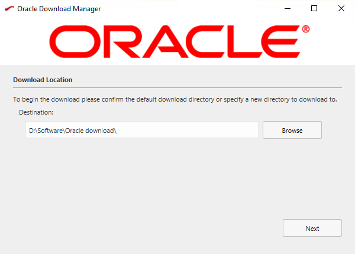

9. Waiting for the download to complete

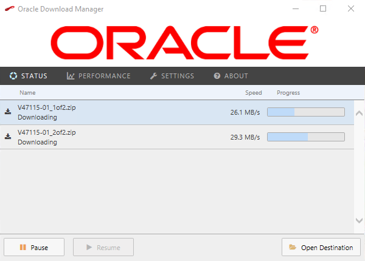

10. Click on Open Destination when the download is complete

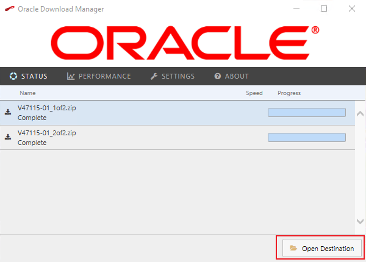

11. Unzip the two downloaded zip archives (both separately, in the same directory)

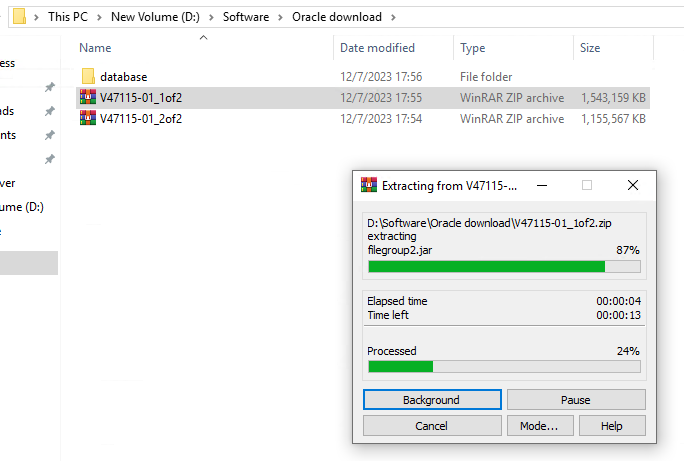

## Installing Oracle

1. Open the directory you just unzipped and double-click to run setup

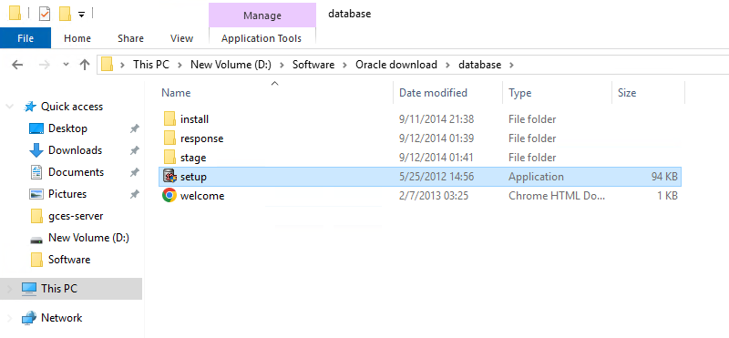

2. No need to enter Email and no need for support, just tap Next and click Yes!

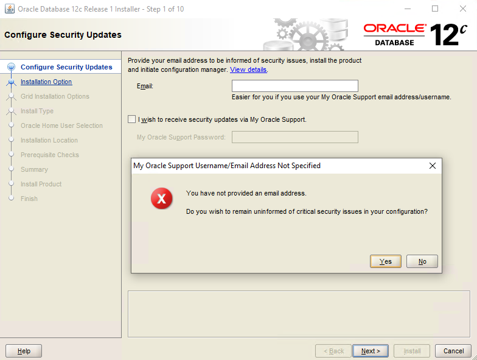

3. Select Create and configure a database and click Next.

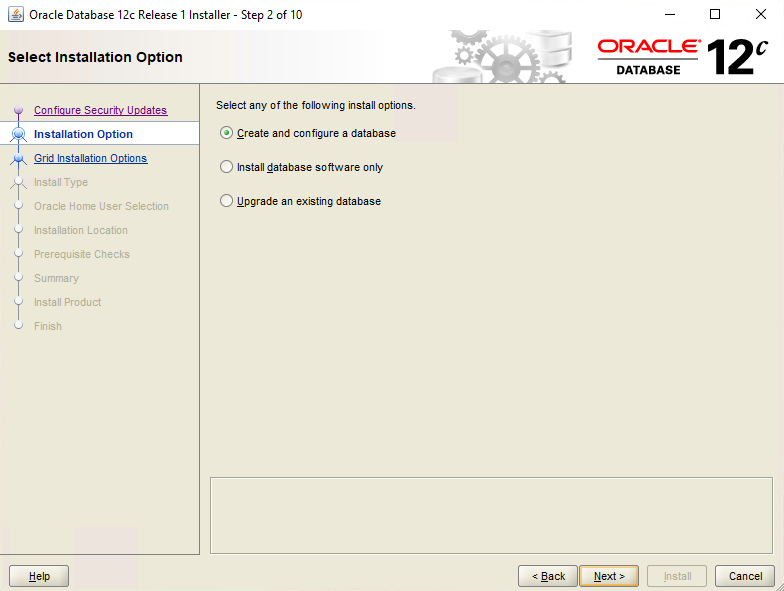

4. Select the Desktop class and click Next.

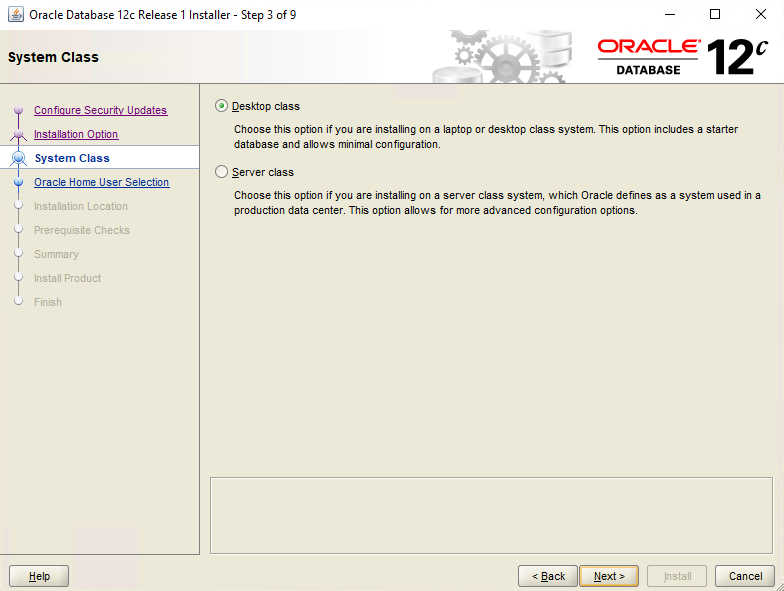

5. Select Create New Windows User, enter your username and password and click Next.

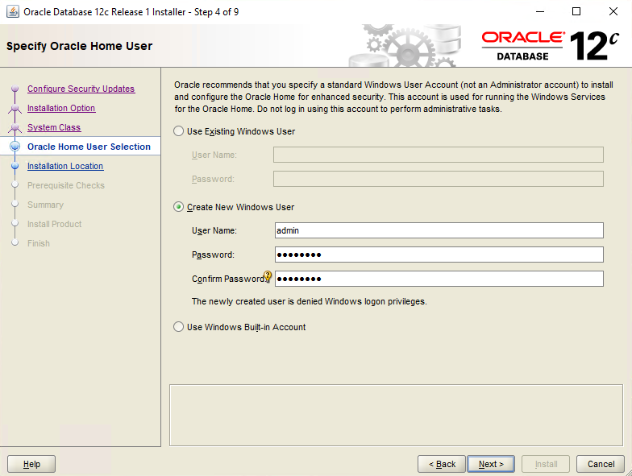

6. Set the installation path, you can change the Global database name, enter the password, and other configuration items and click Next.

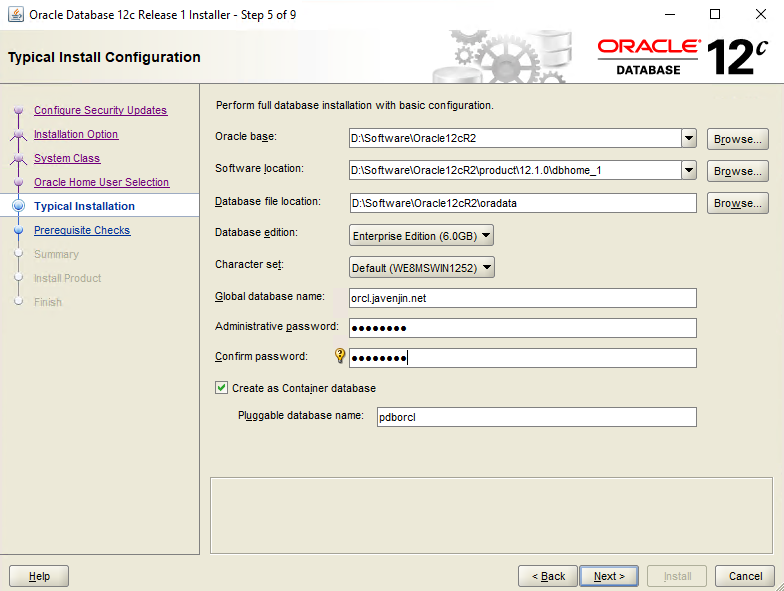

7. Wait for the installer to check the installation environment

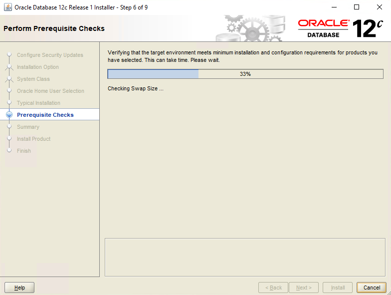

8. Click Install

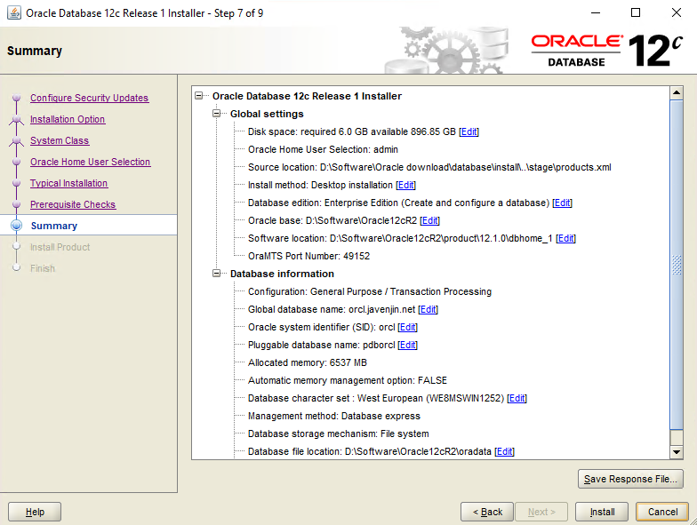

9. Waiting for installation

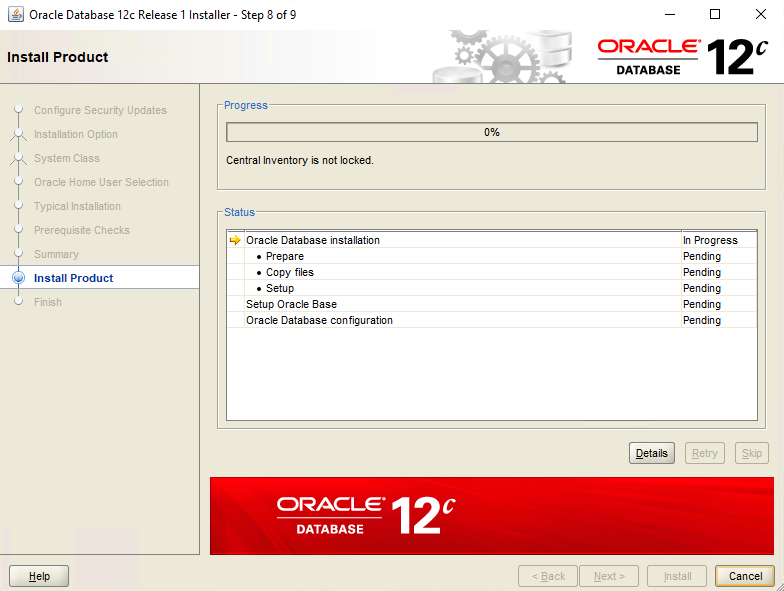


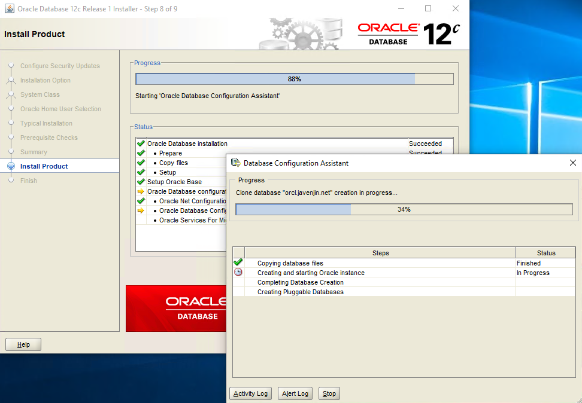

10. Click OK when the installation is complete (you can also click Password Management to configure passwords for other users).

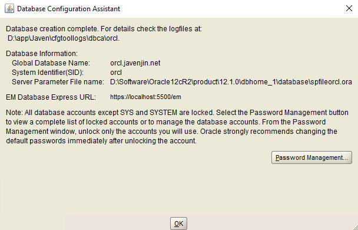

## Verify that the installation was successful

1. The installation program will automatically install SQL Plus, open SQL Plus

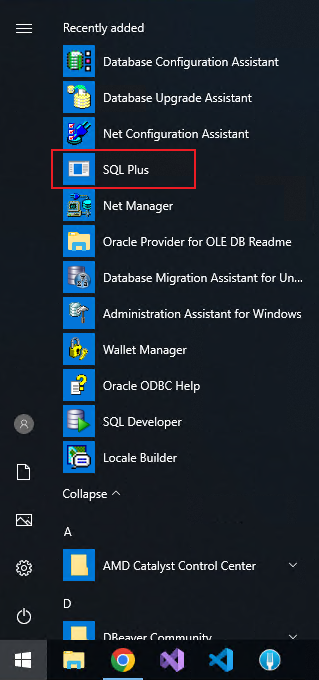

2. Enter the system username SYSTEM and the password as you configured it yourself

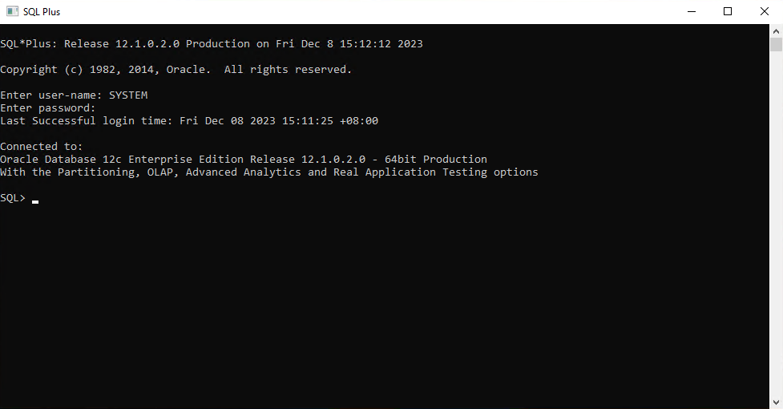

3. Enter the following SQL to query the installed version

```sql
select * from product_component_version;
```

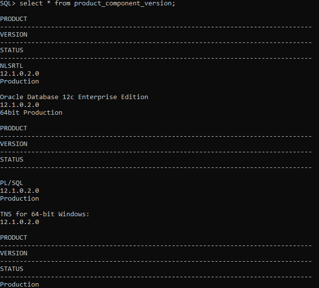