# 在Windows上安装PostgreSQL 16.1

## 前往官网下载PostgreSQL安装包

下载PostgreSQL安装包。

[https://www.enterprisedb.com/downloads/postgres-postgresql-downloads](https://www.enterprisedb.com/downloads/postgres-postgresql-downloads).

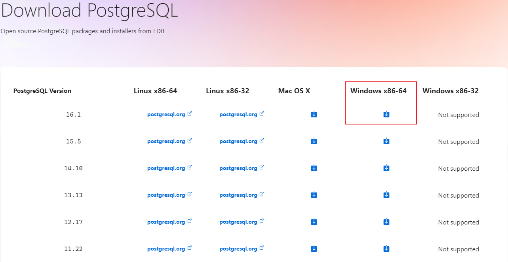

## 打开安装包

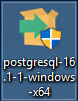

## 点击Next

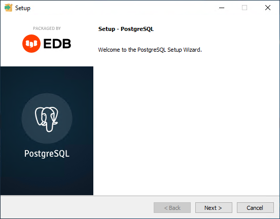

## 修改安装目录然后点击Next

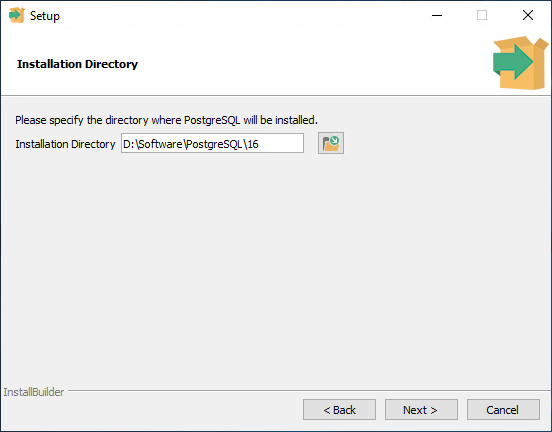

## 保持默认选项，点击Next

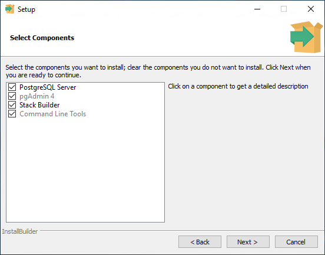

## 设置数据目录，点击Next

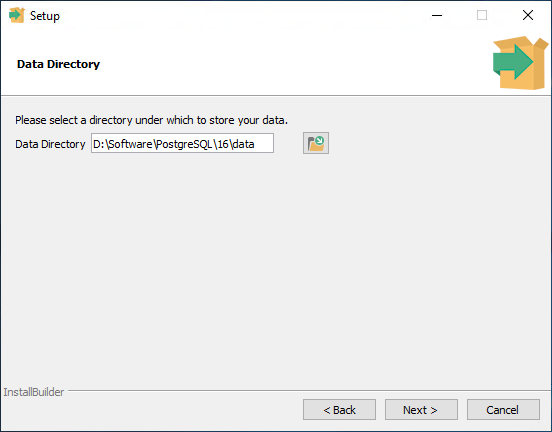

## 设置密码，点击Next

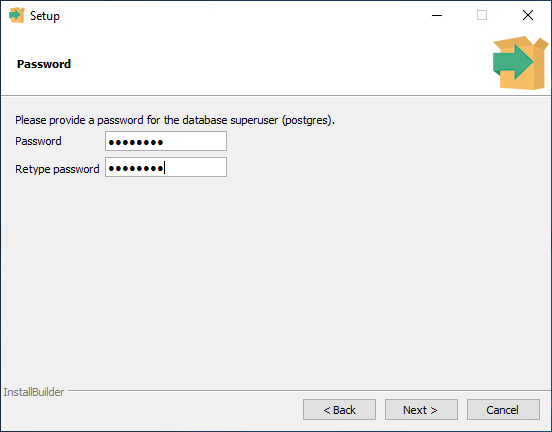

## 设置数据库端口号（默认5432），点击Next

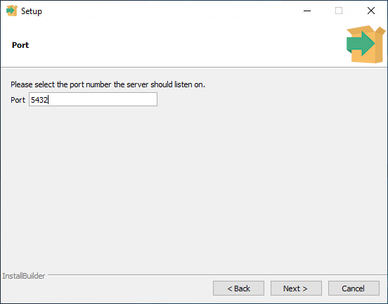

## 设置语言，点击Next

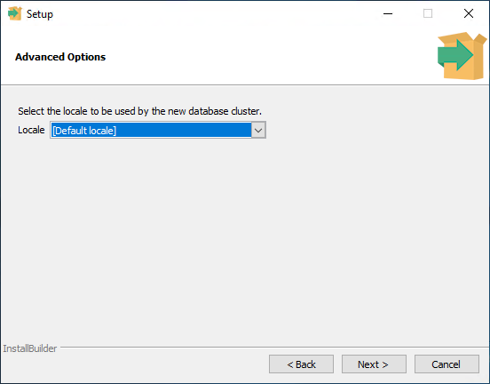

## 后面一直点Next即可

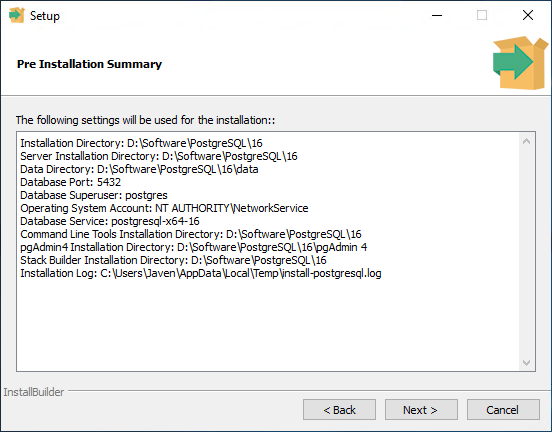

## 等待安装完毕

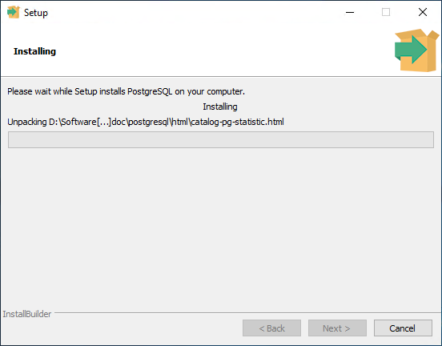

## 取消勾选Stack Builder，点击Finish

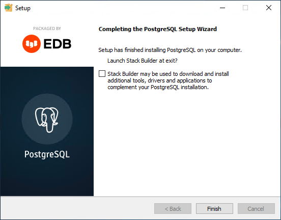

## 至此，PostgreSQL安装完毕

## PostgresSQL安装携带了pgAdmin软件，可以用来管理PostgreSQL数据库，打开pgAdmin

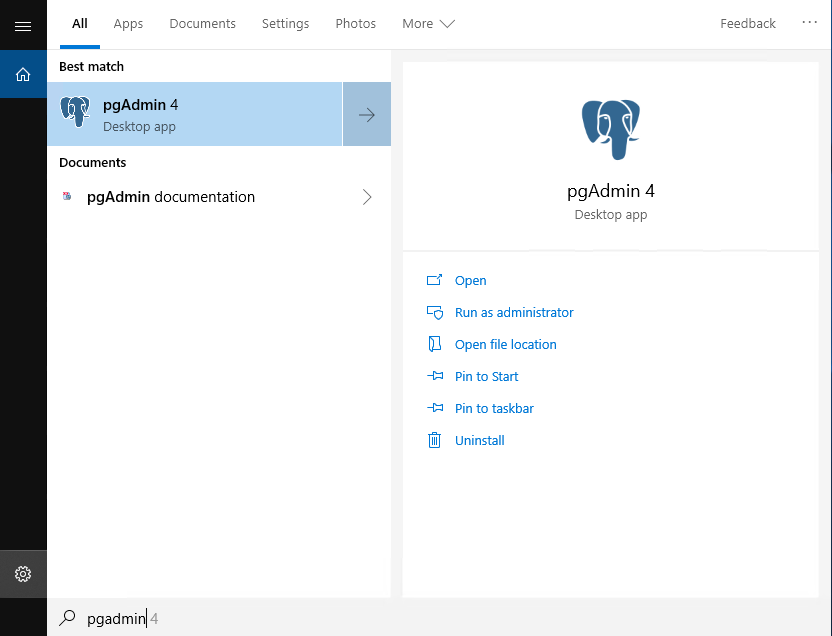

## 点击左上角的Server

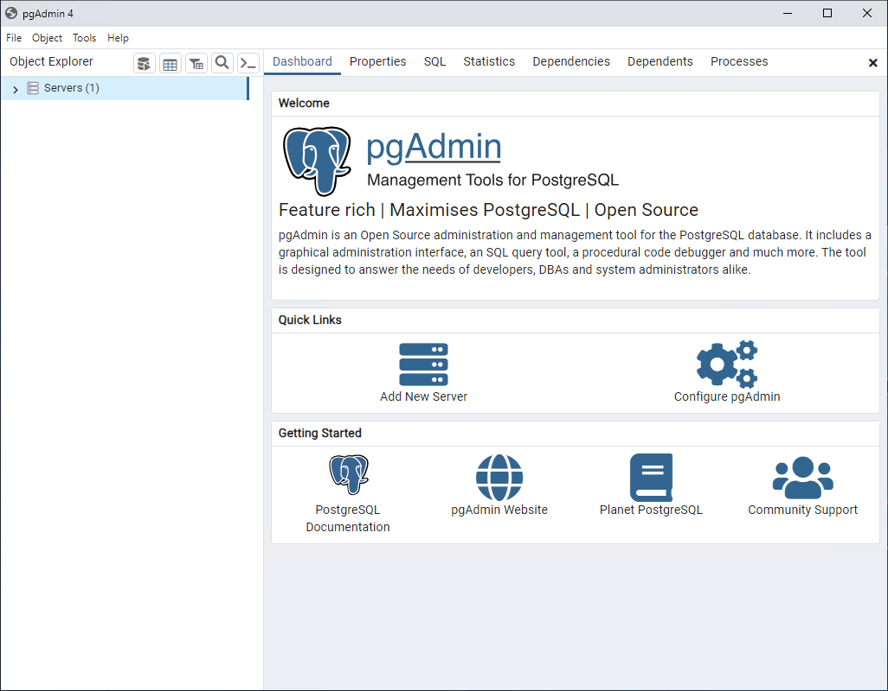

## 输入设置的密码，点击OK

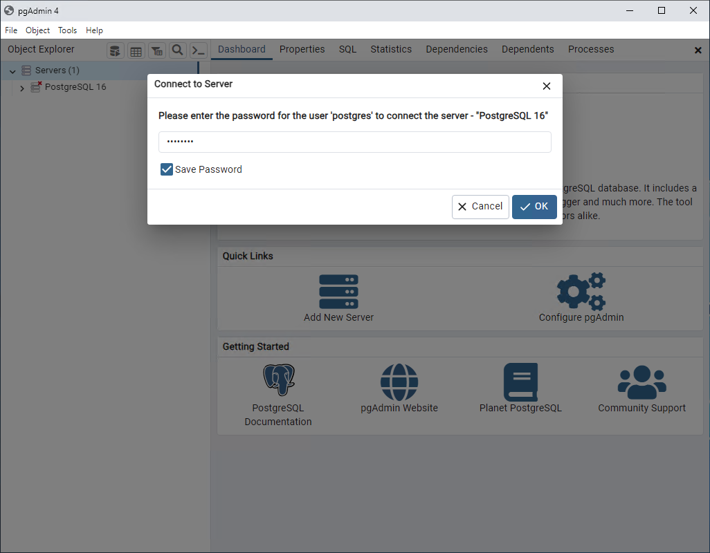

## 如下界面即表示安装成功

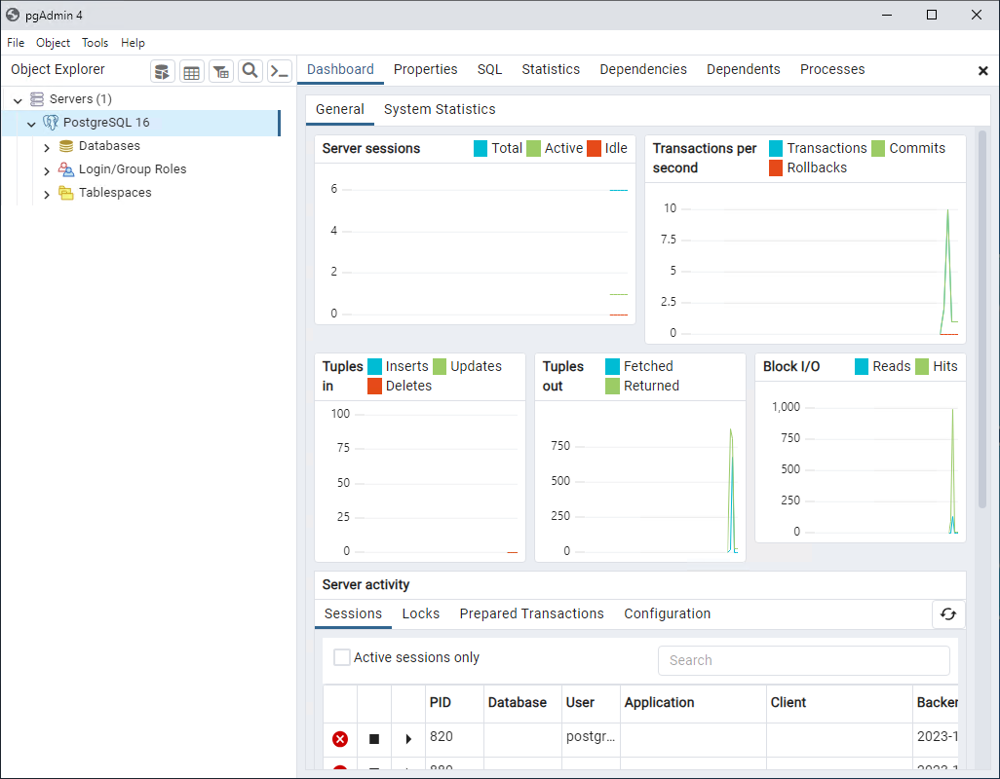

## 也可以使用第三方数据库连接器进行连接测试，PostgreSQL的用户名为postgres