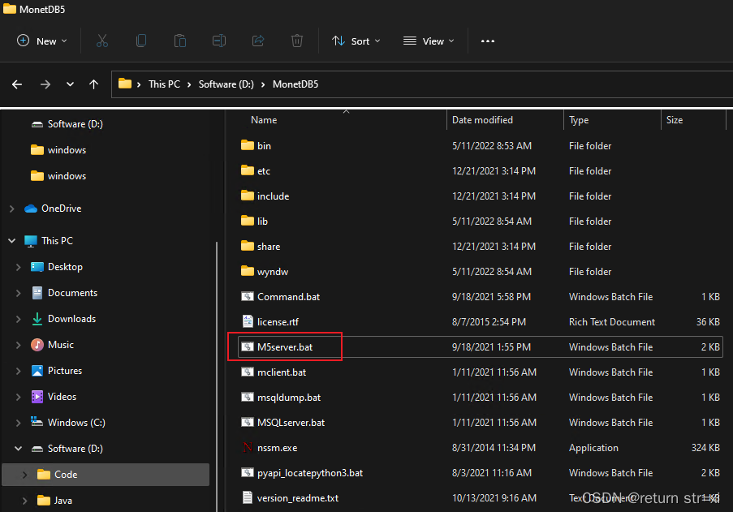
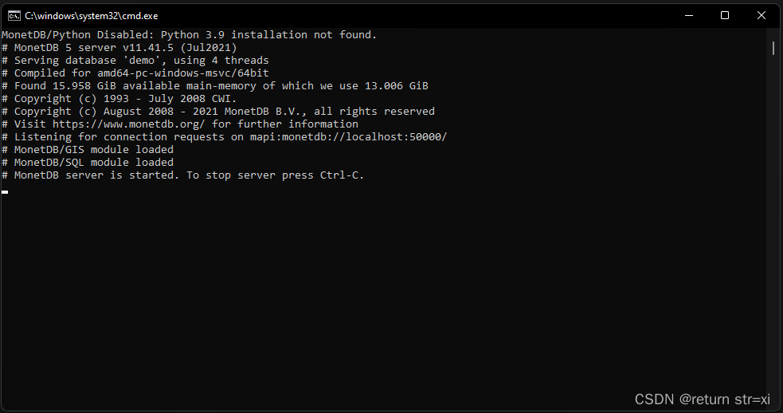
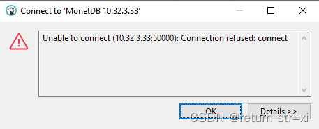
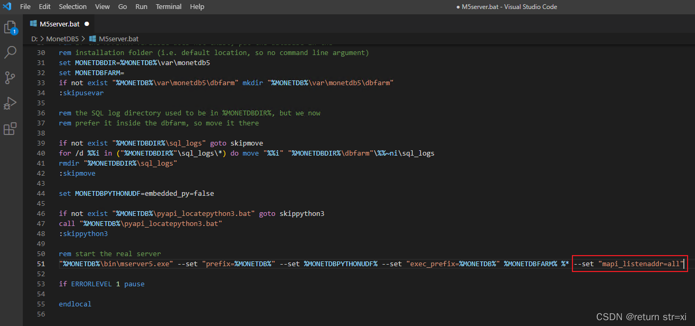
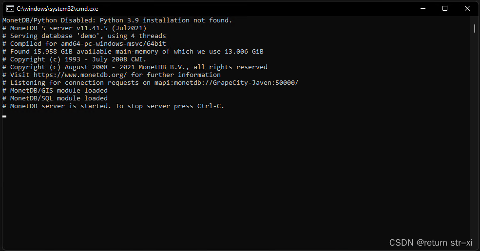
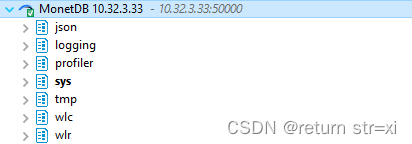

# MonetDB Remote Access

## First of all, we should know that the normal way to start MonetDB is to run the M5server.bat file directly from the installation directory



## After starting up, the following picture, at this time directly using another computer's DBeaver connection will prompt that the connection is rejected





## Edit the M5server.bat file in the installation directory and add the --set "mapi_listenaddr=all" parameter to the start the real server command below

```
--set "mapi_listenaddr=all"
```



## Save the file and re-run M5server.bat



## Finish



## References

[https://www.monetdb.org/documentation-Jan2022/admin-guide/manpages/mserver5/](https://www.monetdb.org/documentation-Jan2022/admin-guide/manpages/mserver5/)