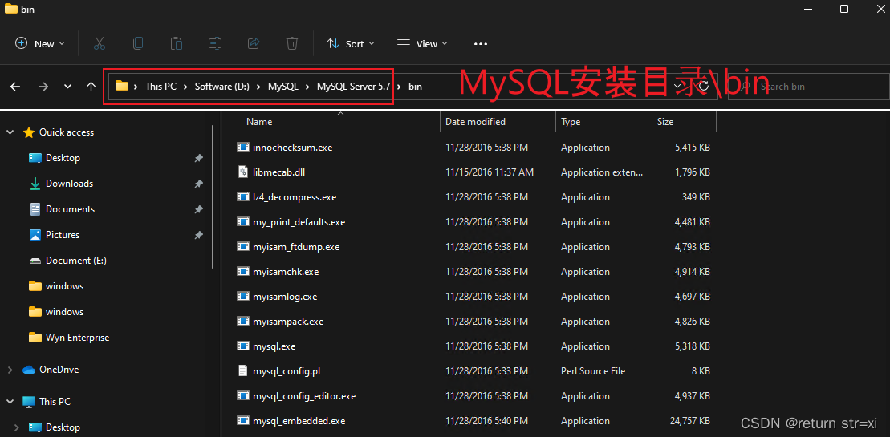
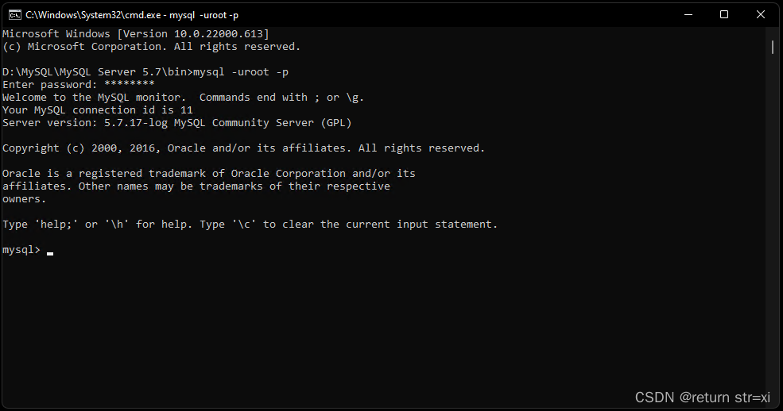
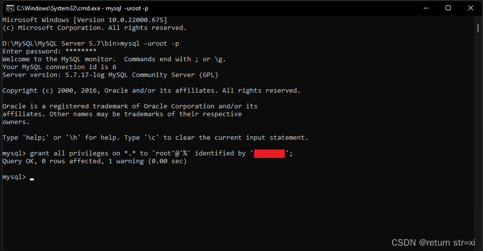
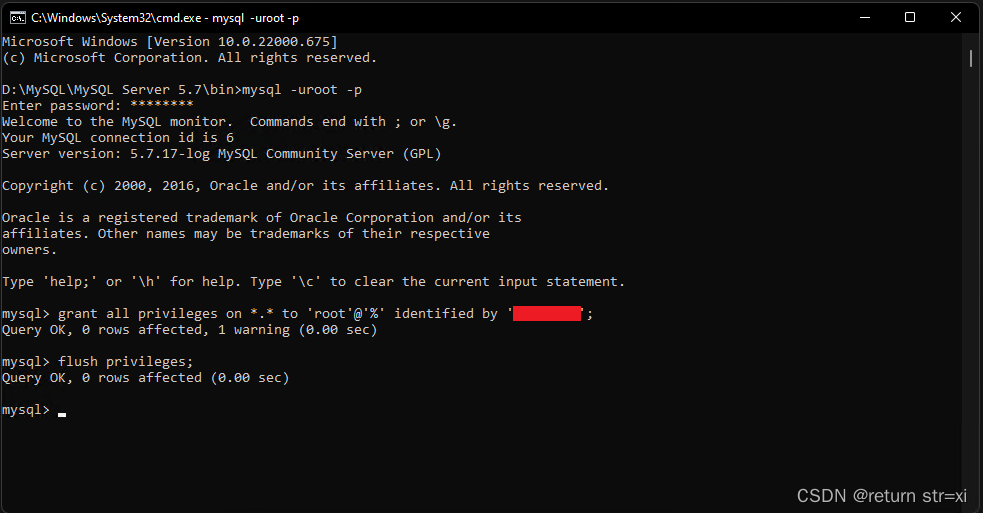
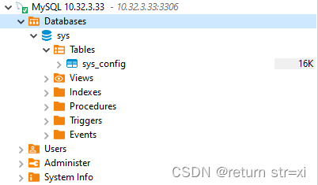

# MySQL 5.7 Remote Access

## Go to the bin directory in the MySQL installation directory (if you have configured environment variables, go directly to step 2)



## Type cmd in the address bar to open a command line window (if you have configured the environment variables directly Win+R type cmd to enter)

## Type the command and enter

```
mysql -uroot -p
```



## Enter the command and enter, where password is the password of your msyql database

```
grant all privileges on *.* to 'root'@'%' identified by 'password';
```



## Type the command and enter

```
flush privileges;
```



## Close the window and finish


