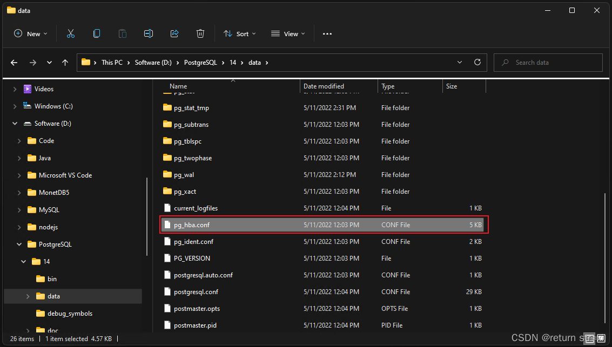
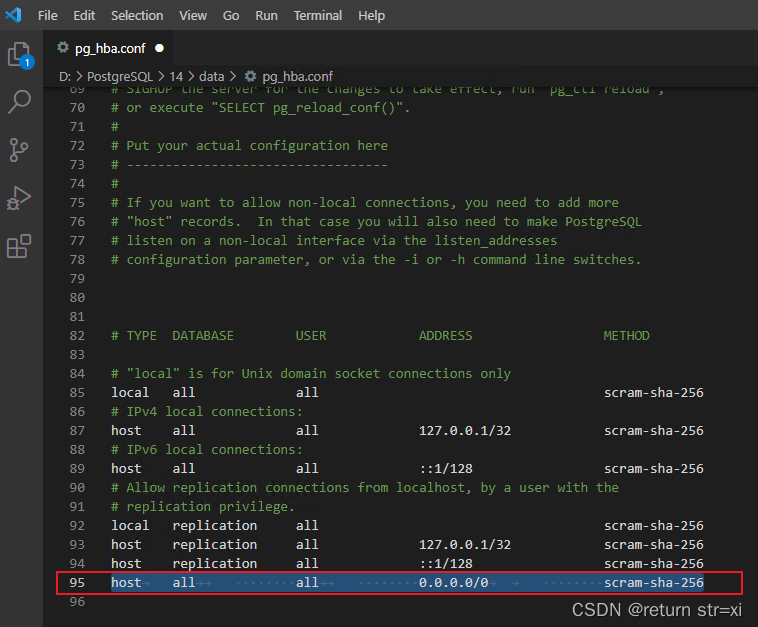
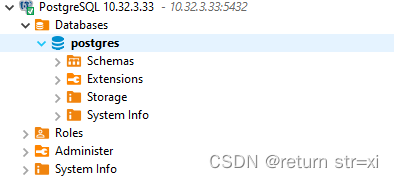

# PostgreSQL Remote Access

## Open the data\pg_hba.conf file in the PostgreSQL installation directory



## Add the following line

```
host	all		        all		        0.0.0.0/0		        scram-sha-256
```



## Save to exit, done


