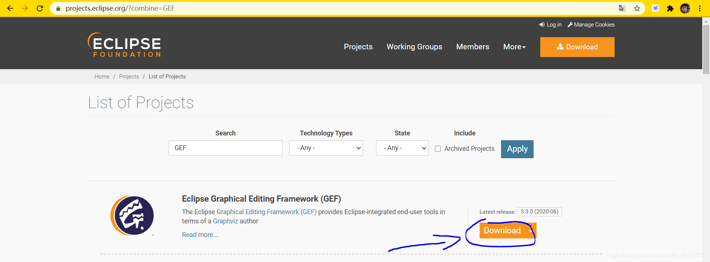
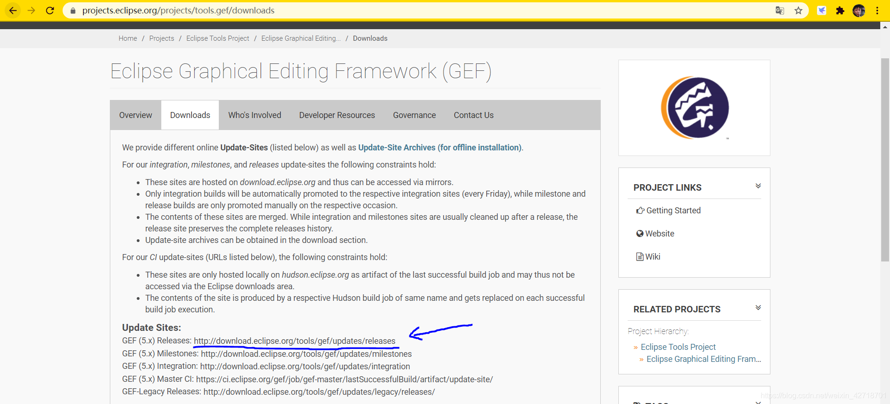
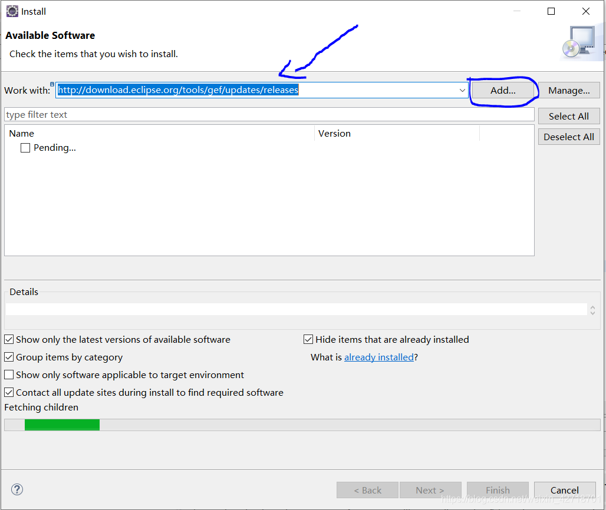
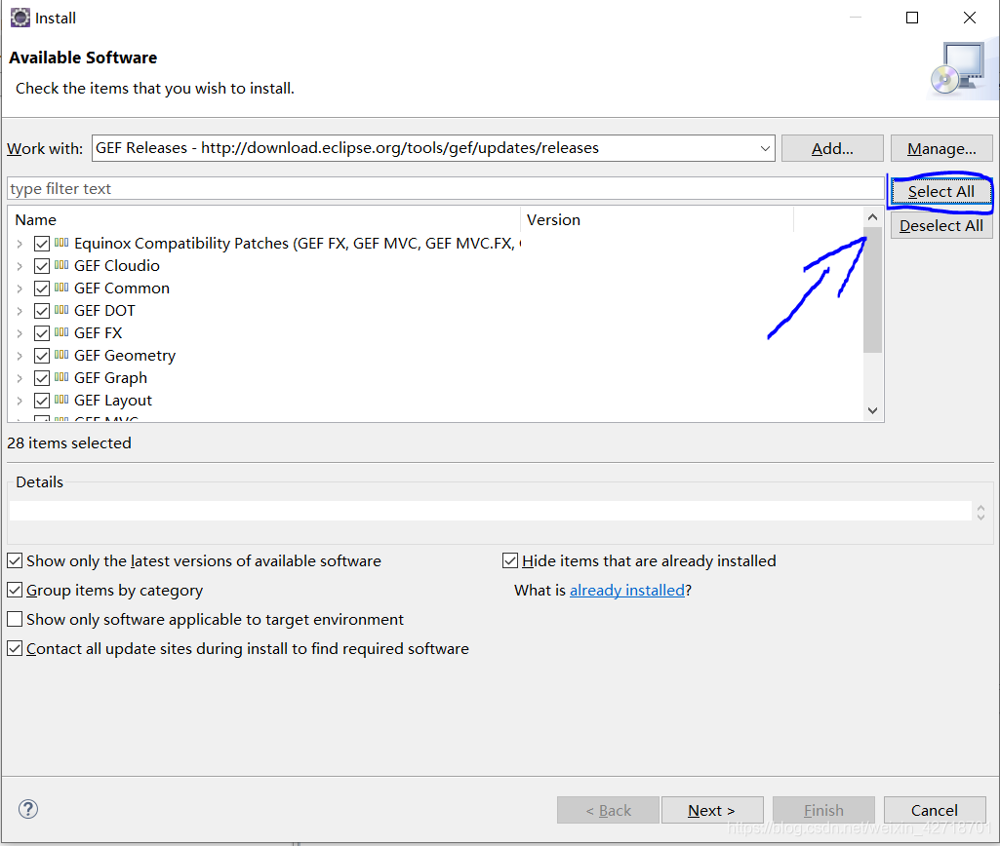
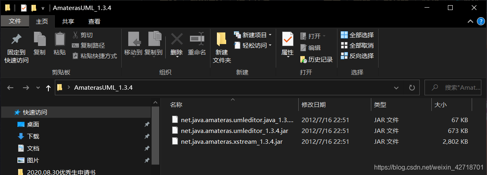
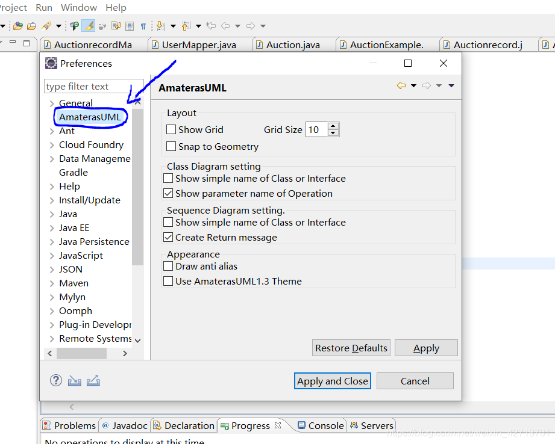
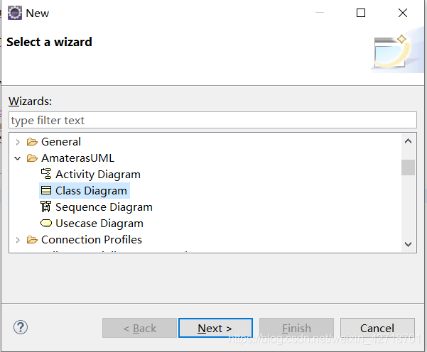
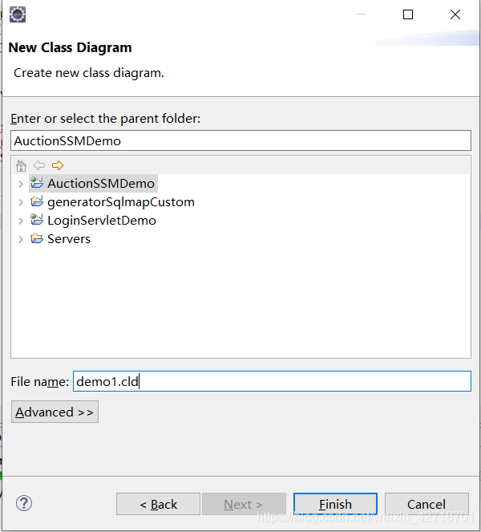
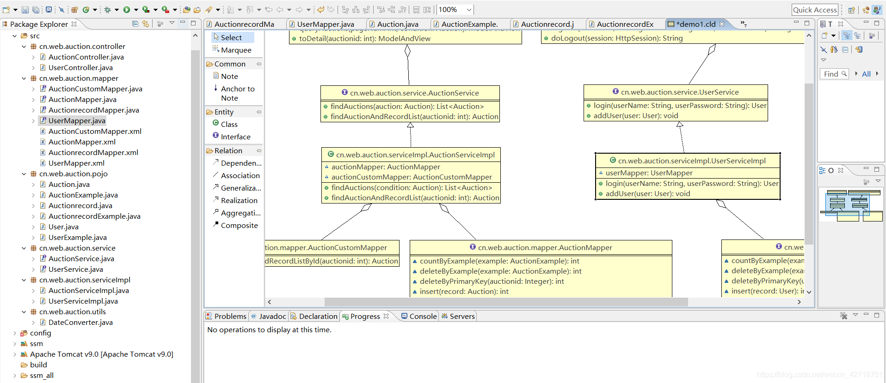

# eclipse中安装和使用AmaterasUML插件绘制类图

## 安装GEF插件

### 打开eclipse官网 https://www.eclipse.org/

### 点击Projects，搜索GEF

### 点击右边的Download

### 在弹出的窗口中，复制下载地址

现在的地址是：http://download.eclipse.org/tools/gef/updates/releases

### 打开eclipse，点击上方Help，选择install new software，粘贴复制的地址，点击Add，插件名字可以为空

### 选择Select All（不知道需要那个，全部安装也不大），然后一直Next和accept就好了

## 安装AmaterasUML插件

### 下载AmaterasUML_1.3.4

下载地址：[AmaterasUML_1.3.4](https://download.csdn.net/download/weixin_42718701/12812743)

也可以去官网下载最新版本的AmaterasUML

### 下载好了之后解压，解压出来有3个jar包，复制到eclipse安装目录的plugins目录下，重启eclipse

### 通过Window-Preference可以看到AmaterasUML

## AmaterasUML的简单使用

### 右键单击一个工程，New-Other，选择Class Diagram，然后点击Next

### 给类图取一个名字，然后点击Finish

### 然后拖动类或接口到界面中，类就华丽的出现了

