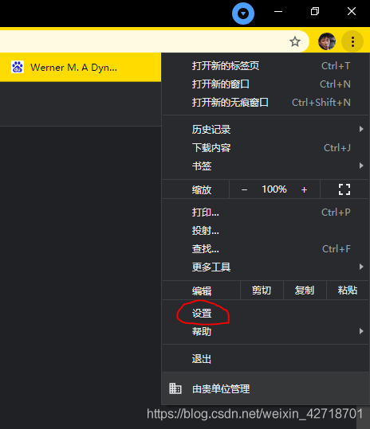
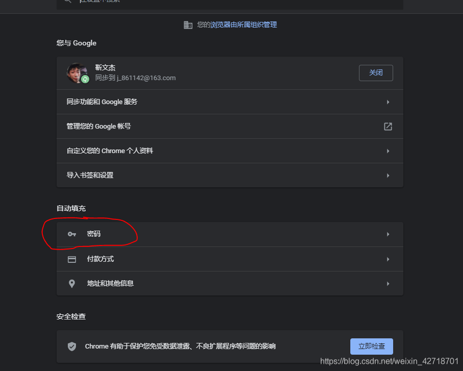
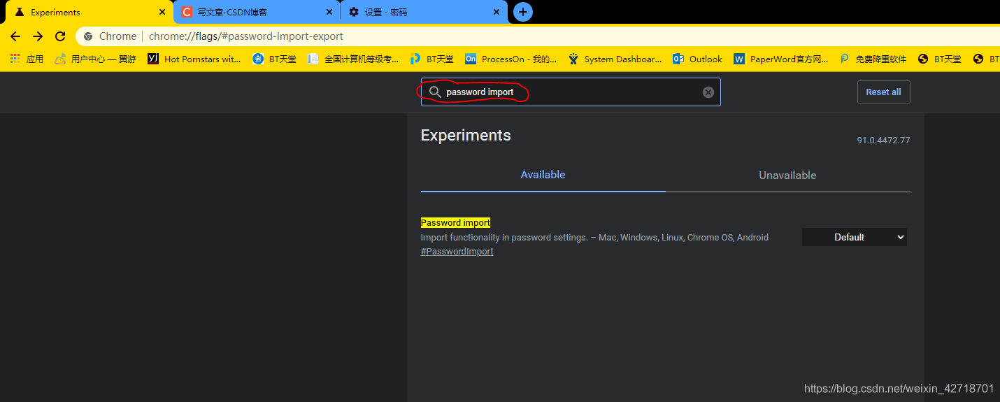
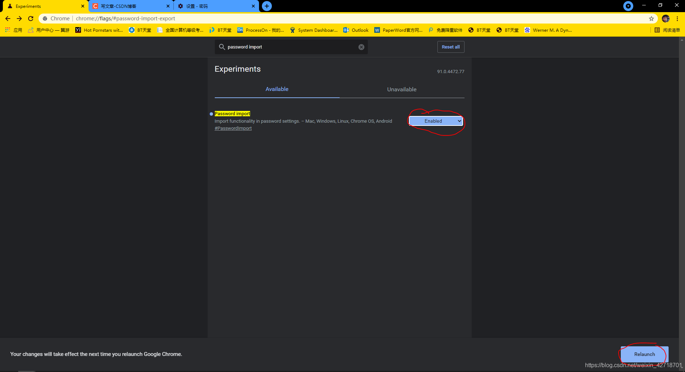
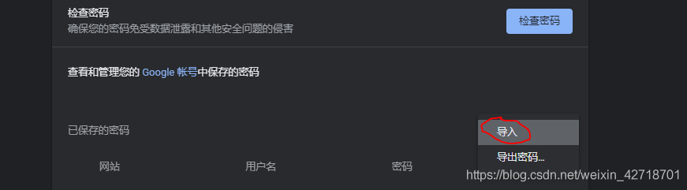

# 谷歌Chrome浏览器导出密码和导入密码

&nbsp;&nbsp;&nbsp;&nbsp;&nbsp;&nbsp;&nbsp;有时候大家遇到换了新电脑，或者公司需要调整电脑，或者说需要导入别人电脑上谷歌浏览器存的账号密码，发现可以导出密码，但是没有导入密码的选项，就很烦，这里教大家如何导出导入chrome谷歌浏览器的账号密码。

## 导出账号密码

### 点击右上角的设置

### 选择密码

### 点击右边的更多操作

### 点击导出密码即可

### 导出的密码是csv格式，可以用excel查看，但仍不方便，那么如何导入呢？

## 导入账号密码

### 打开谷歌浏览器，在地址栏输入chrome://flags/#password-import-export

### 然后在上面的搜索栏搜索：password import

### 然后选择右边的Default为Enabled，并点击下方Relaunch刷新浏览器

### 最后重新进入导出密码的地方，就可以看到导入的选项啦

### 导入自己从别的电脑导出的密码，就会发现两台电脑的谷歌浏览器所拥有的密码一样啦