# Install Tomcat8 on Windows

## Download the installation package

**Visit Tomcat official website [https://tomcat.apache.org/](https://tomcat.apache.org/)**

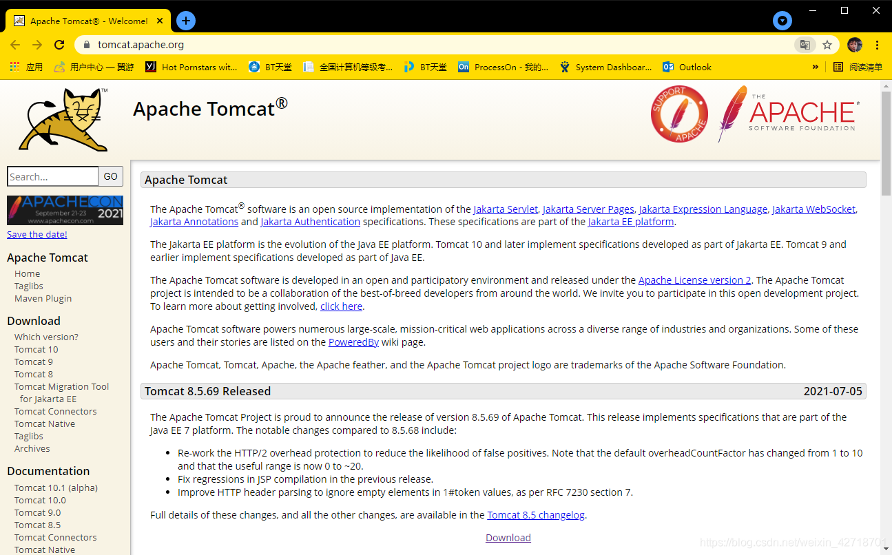

**Select the download version in the Download column on the left, the version selected here is Tomcat8, click into **

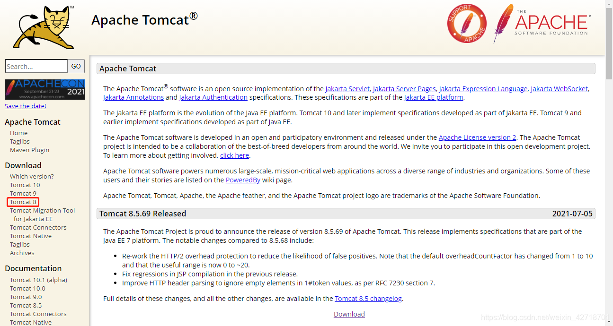

**Choose the corresponding version to download according to your system version, here choose the Windows 64-bit operating system version, as shown in the picture click download**

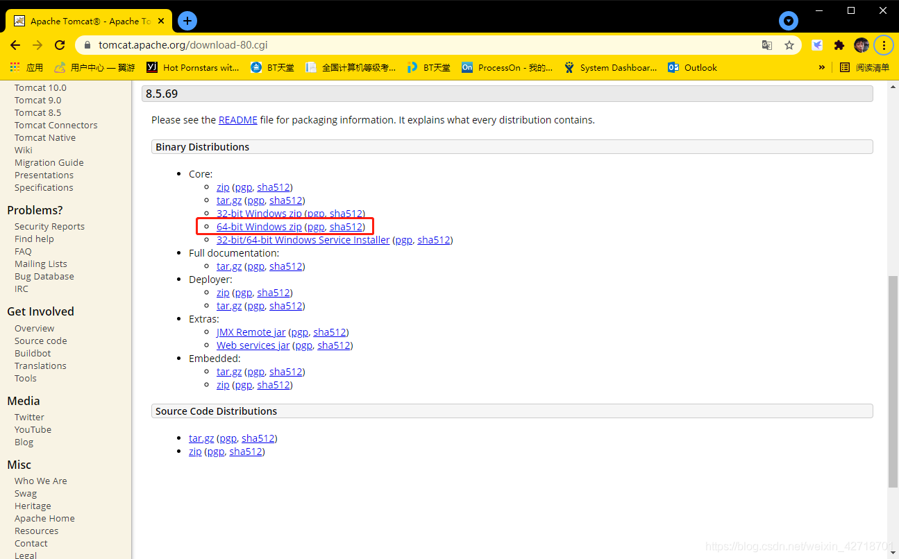

## Install Tomcat8 (the downloaded zip package is the installation-free version, you can use it directly after decompression)

**Unzip the downloaded file**

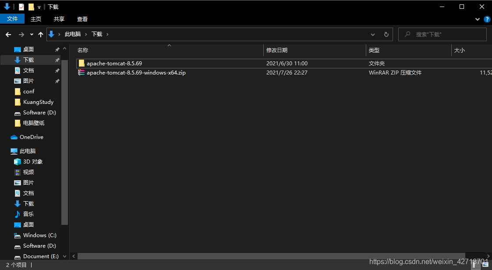

**Place the unpacked files on the D drive**

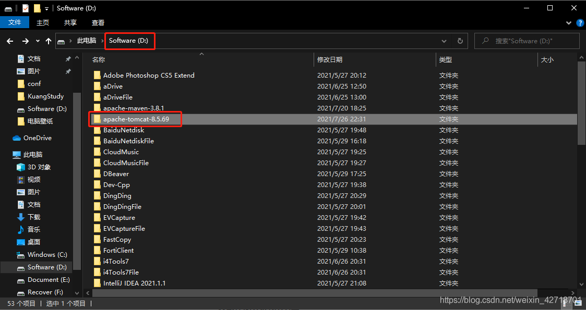

## Configure environment variables

**Right-click on properties on this computer and open settings**

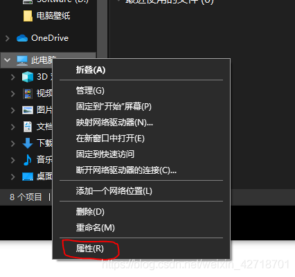

**Click on Advanced System Settings to open System Properties**

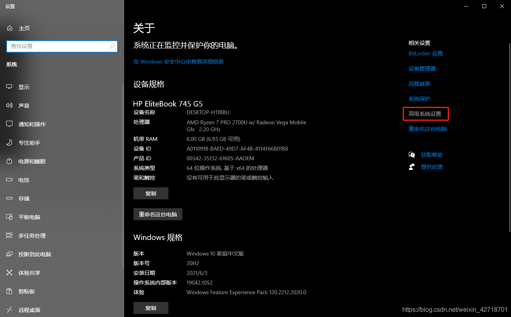

**Click on environment variables to open environment variables**

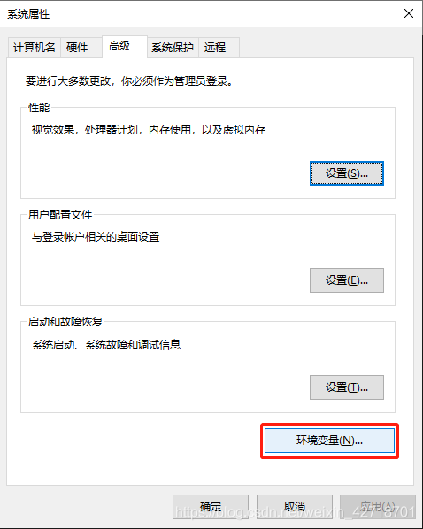

**Select path and click edit to enter the edit path variable page**

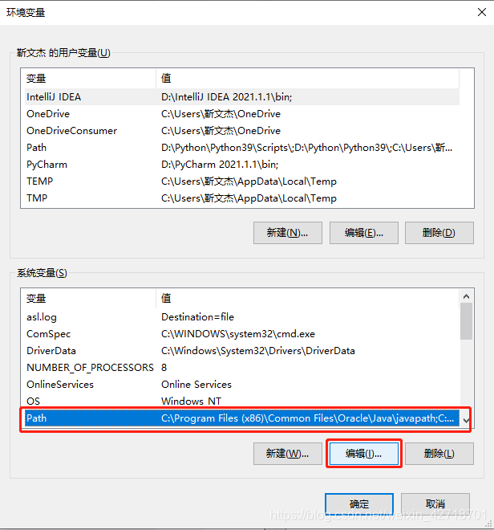

**Click New, enter the directory of the bin folder under the installation directory of Tomcat8, click OK, OK, OK**

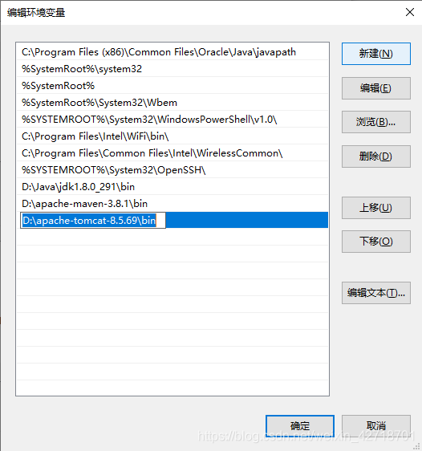

## Run the command

**Go to the bin folder in the Tomcat8 installation directory**

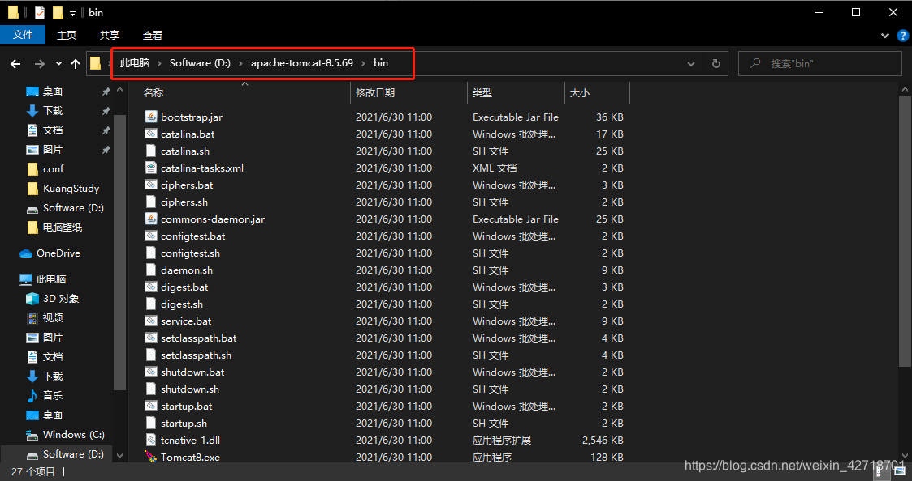

**Click on the address bar, type cmd and enter to open a command line window**

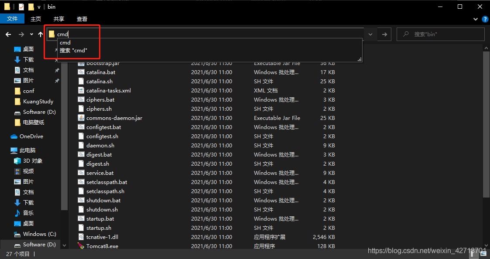

**Type service.bat install in the command line window and enter**

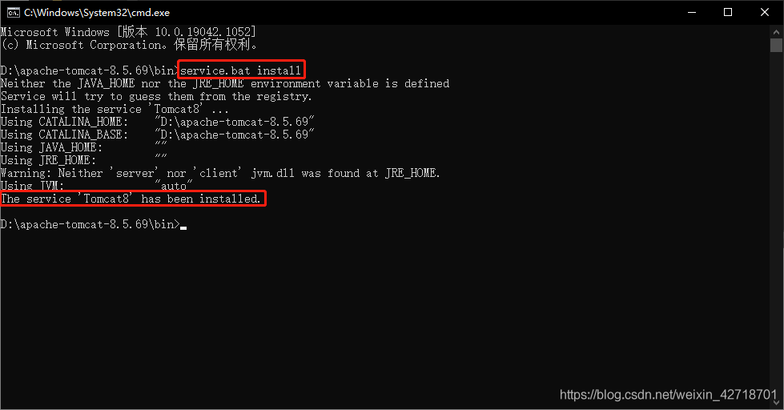

**The installation is successful if the picture is displayed**

## Test whether it is successful

**Double-click to run the Tomcat8w.exe file in the bin folder to open the startup window**

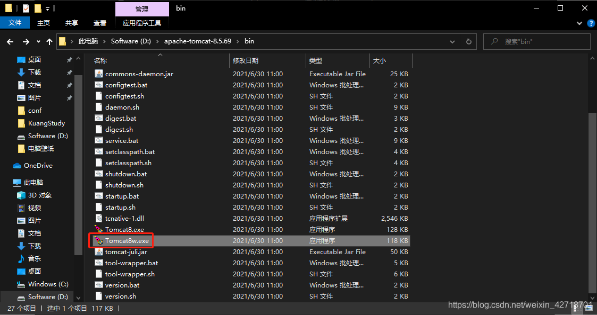

**Click Start to start Tomcat8**

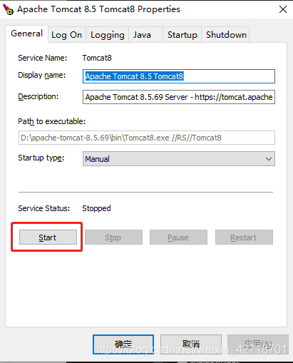

**Open the browser, enter 127.0.0.1:8080 to access the following screen is a successful installation**

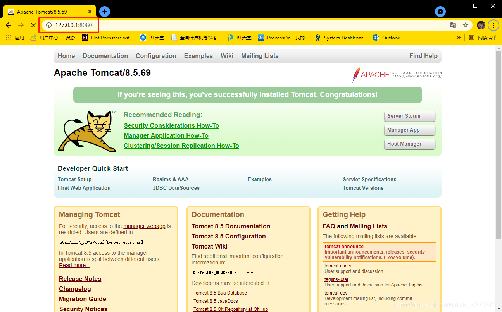
