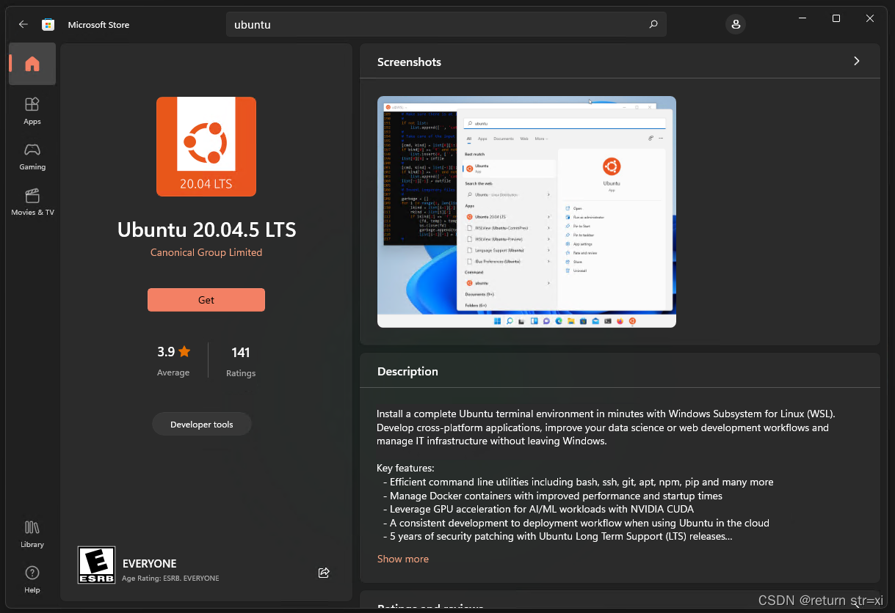
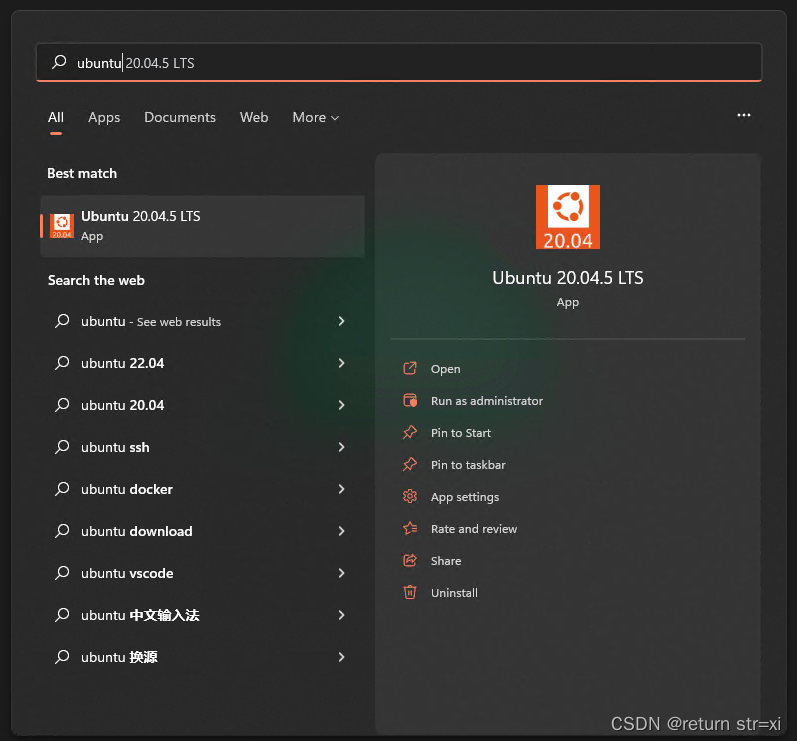
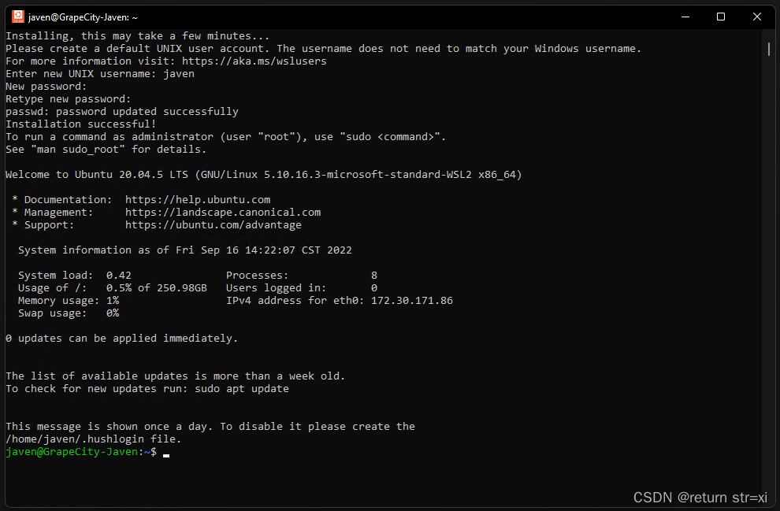
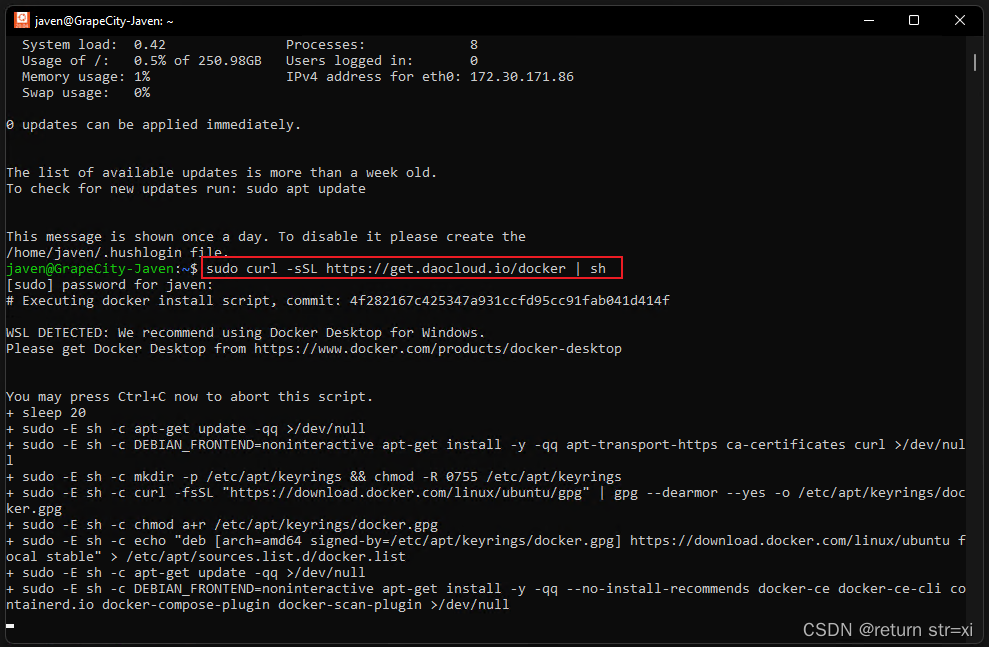
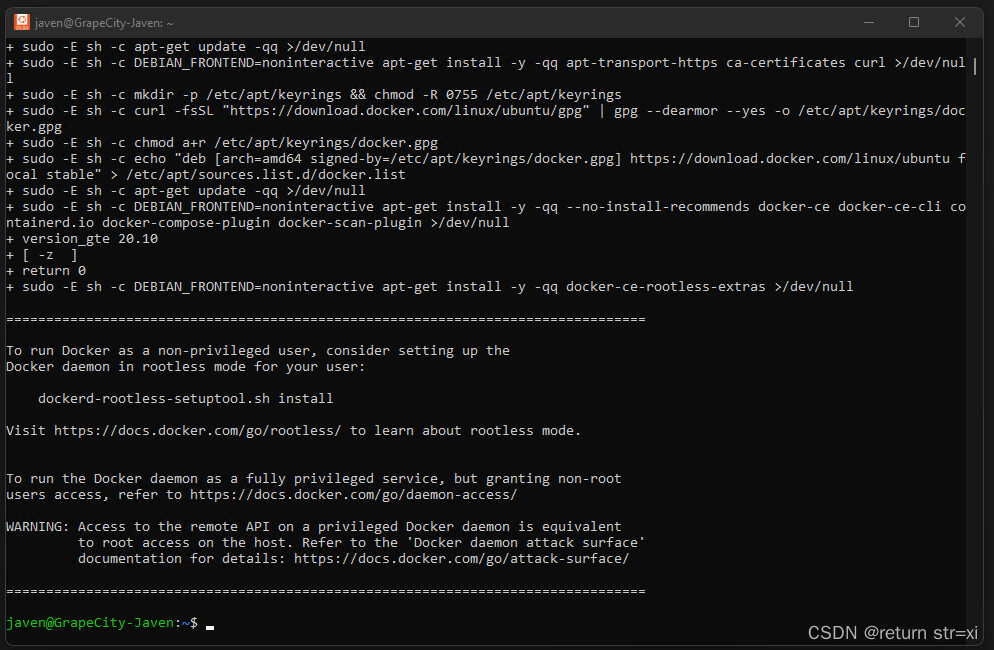
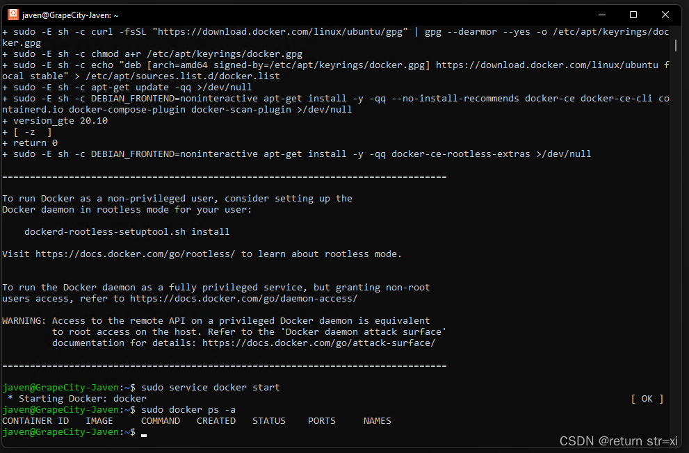
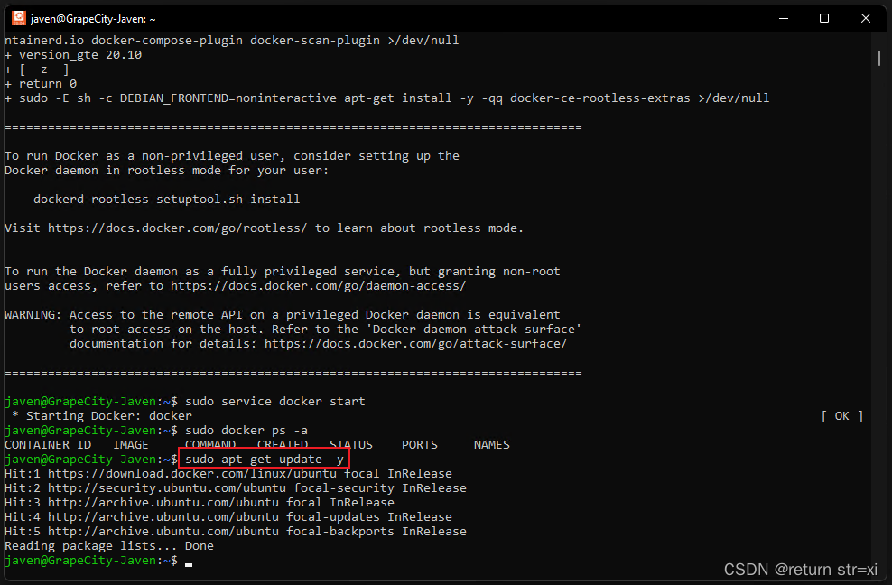
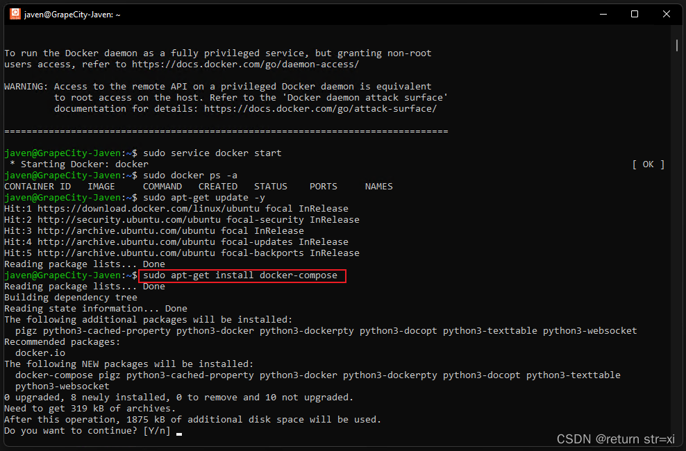
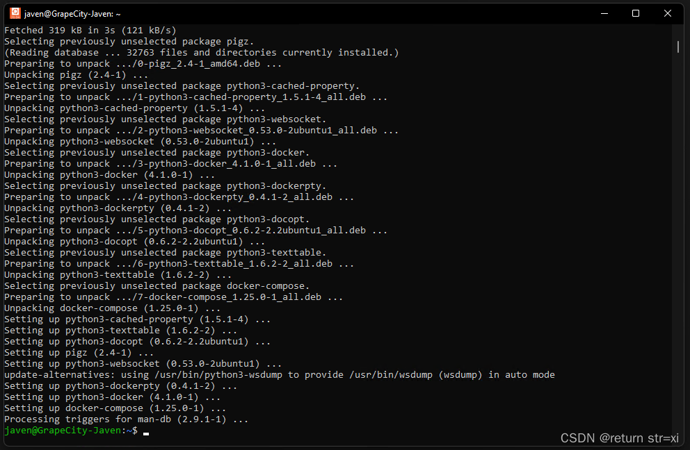

# Install Ubuntu on Windows subsystem using WSL2 technology

## Install WSL2

Reference: [Manual installation steps for older versions of WSL](https://docs.microsoft.com/en-us/windows/wsl/install-manual)

### Enabling the Windows subsystem for Linux

Open PowerShell as administrator (Start menu > PowerShell > right-click > Run as administrator) and enter the following command:

```sh
dism.exe /online /enable-feature /featurename:Microsoft-Windows-Subsystem-Linux /all /norestart
```

### Start the virtual machine function

Open PowerShell as administrator and run:

```sh
dism.exe /online /enable-feature /featurename:VirtualMachinePlatform /all /norestart
```

### Restart the computer

### Download the Linux kernel update package and install it

Download address 1 (Microsoft official website download): [Linux kernel update packages](https://wslstorestorage.blob.core.windows.net/wslblob/wsl_update_x64.msi)

Download address 2 (csdn download): [Linux kernel update packages](https://download.csdn.net/download/weixin_42718701/86540810)

Run the downloaded update package. (Double click to run - you will be prompted to elevate privileges, select "Yes" to approve this installation.)

### Set WSL2 as the default version

Open PowerShell and run the following command to set WSL 2 as the default version when installing a new Linux distribution:

```sh
wsl --set-default-version 2
```

## Install Ubuntu and install docker and docker-compose

Install Ubuntu Reference: [https://docs.microsoft.com/en-us/windows/wsl/install-manual](https://docs.microsoft.com/en-us/windows/wsl/install-manual)

Install Docker Reference: [https://www.runoob.com/docker/ubuntu-docker-install.html](https://www.runoob.com/docker/ubuntu-docker-install.html)

Install Docker-Compose Reference: [https://linuxhostsupport.com/blog/how-to-install-and-configure-docker-compose-on-ubuntu-20-04/](https://linuxhostsupport.com/blog/how-to-install-and-configure-docker-compose-on-ubuntu-20-04/)

### Open the [Microsoft Store](https://aka.ms/wslstore) and select the Ubuntu version to download




### Wait for the automatic installation to succeed


### Start Ubuntu and wait for it to install automatically



### After setting the username and password, enter the Ubuntu system



### Install Docker

Use th daocloud one-click installation command:

The installation command is as follows:

```sh
sudo curl -sSL https://get.daocloud.io/docker | sh
```



Wait for successful installation



Start the docker service command

```sh
sudo service docker start
```

Check if the installation is successful command

```
sudo docker ps -a
```

The installation of Ubuntu Docker is successful when the following is displayed



### Install docker-compose

Update the apt-get command:

```sh
sudo apt-get update -y
```



Install the docker-compose command:

```sh
sudo apt-get install docker-compose
```



Enter y in the middle to enter



Installation complete!