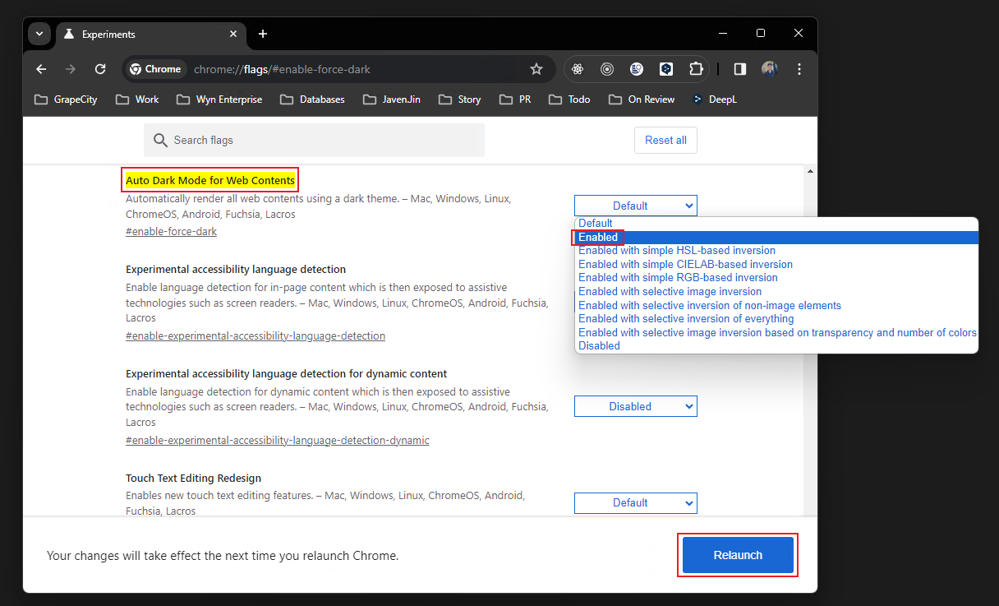
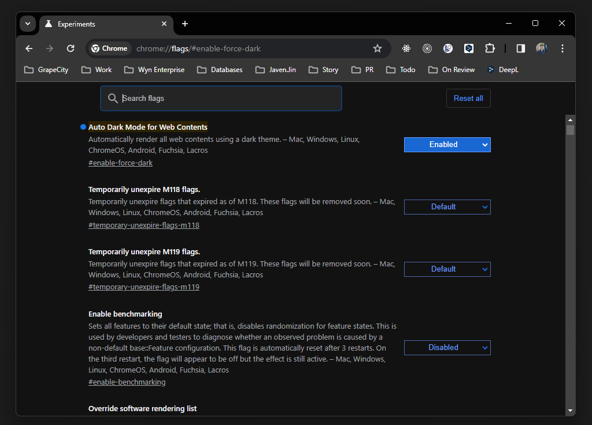

# Setting Black Mode in Chrome

Enter the following address in the URL field:

```
chrome://flags/#enable-force-dark
```

After clicking Enter, the following is displayed:



Set the value of Auto Dark Mode for Web Contents to Enabled.

Just click Relaunch below to restart Chrome after setting it up.

