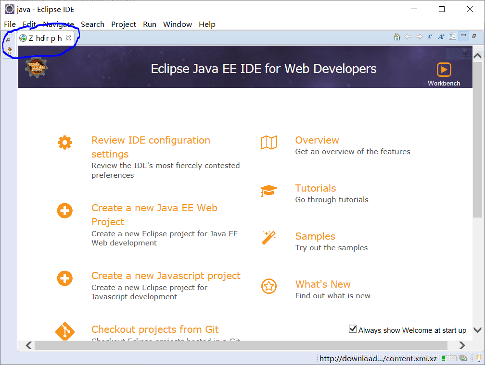
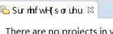
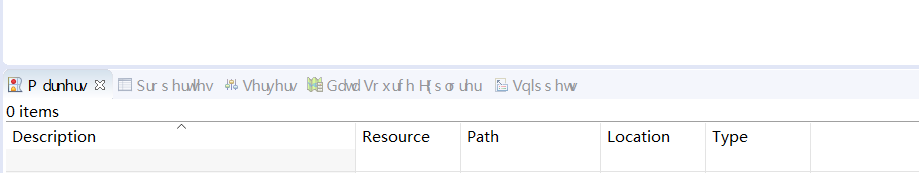
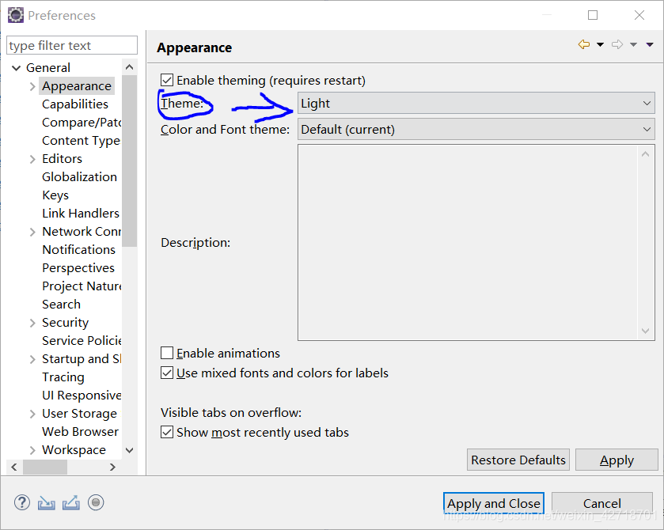
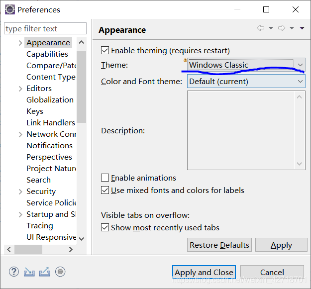
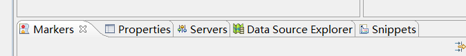
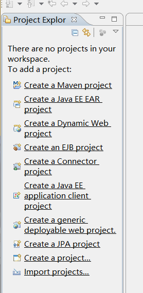

# Switching eclipse after the menu bar messy problem

## Question

Today I switched the working directory of eclipse

After opening it, I found a messy menu bar problem

eclipse opens like this:

I found that the menu bar is all messed up

## Solution

Workaround: Open Window - Preferences - General - Appearance

Modify the right Theme to Windows Classic

Then tap Apply or Apply and Close and you're done.

