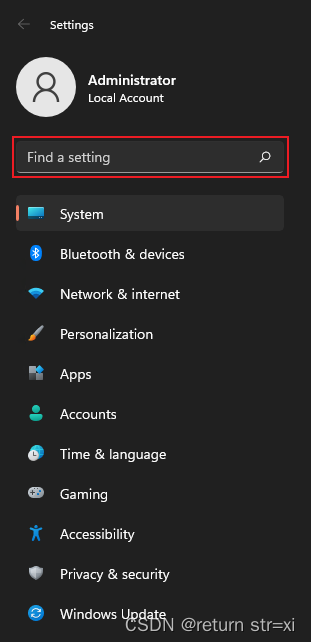
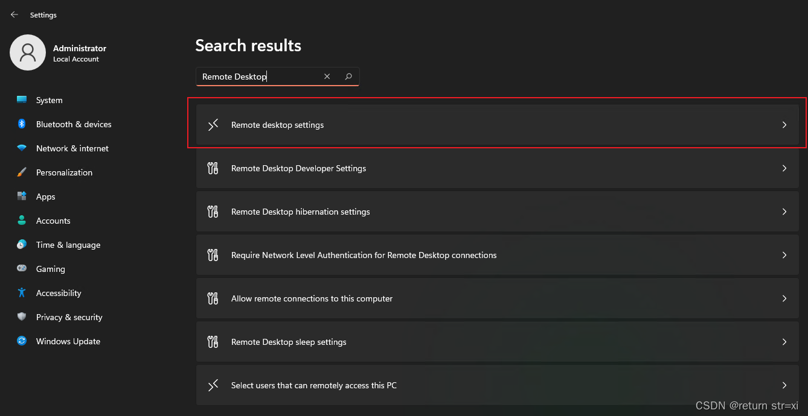
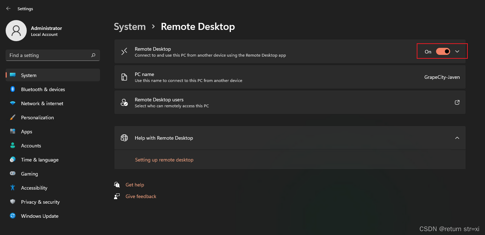
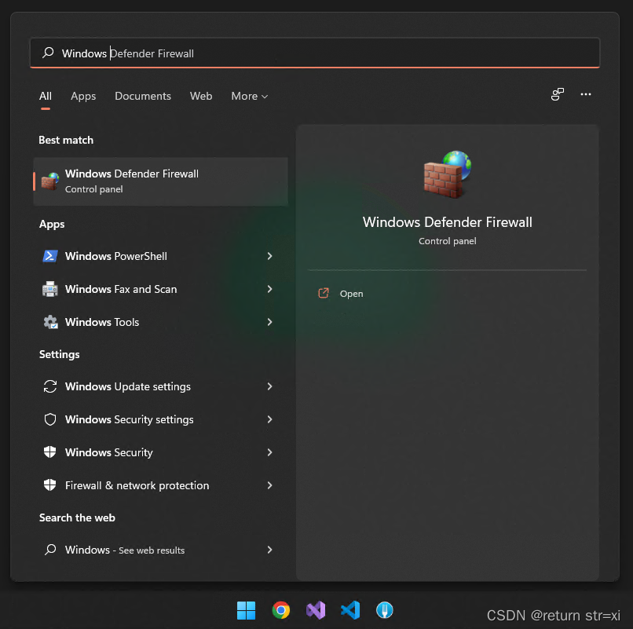
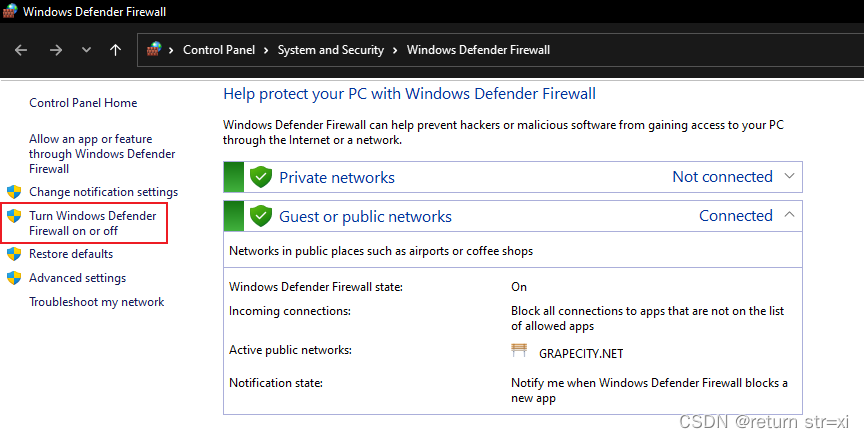
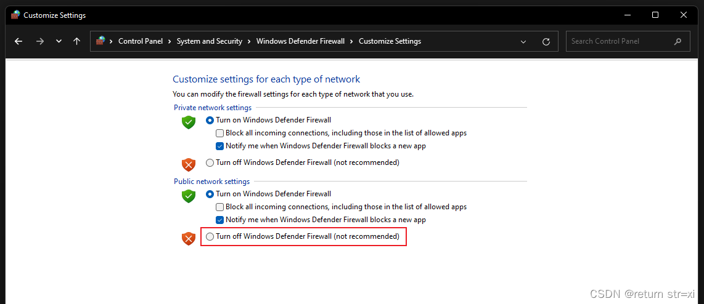
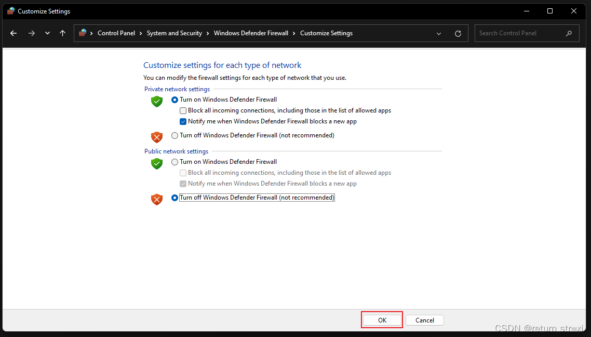
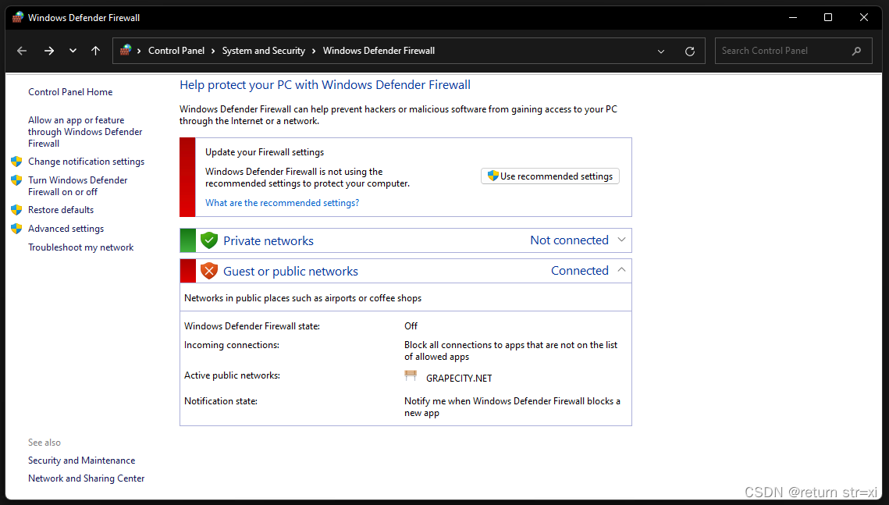

# Windows 11 允许远程桌面/远程访问

## Windows 11 允许远程桌面

### 打开设置

### 搜索Remote Desktop

### 打开Remote Desktop

## Windows 11 允许远程访问

### 搜索打开Windows Defender Firewall

### 点击Turn Windows Defender Firewall on or off

### 将Public network settings 选择 Turn off Windows Defender Firewall (not recommended)

### 点击下方OK保存

### 显示如图即可

